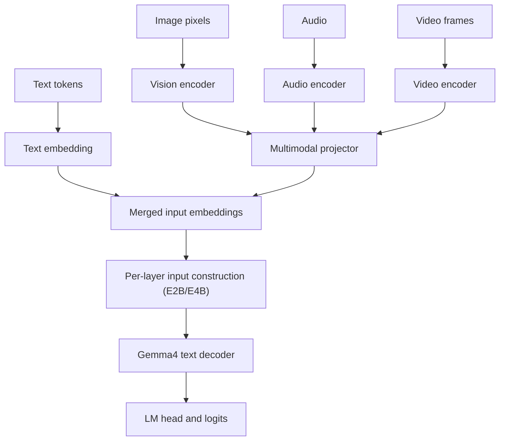
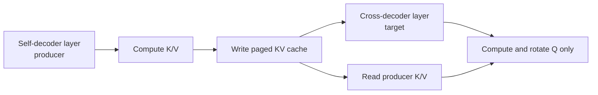

# 01 模型结构分析

[返回总览](README.md) | [下一篇：A2/A3/A5 适配过程](02_A2_A3_A5适配过程.md)

## 1. 为什么必须先分析模型结构

加速后端只能在明确模型语义后选择算子。Gemma4 的很多问题表面发生在 NPU kernel、ACLGraph 或 KV cache，实际根源是后端错误地把两种不同语义的 layer 当成同一种：

- sliding 与 global attention 的 head dimension 不同；
- global layer 可能 K=V；
- Dense 与 MoE 的 FFN 结构不同；
- KV-sharing target 是 cache reader，不是 cache writer；
- PLE 为每一层提供独立输入；
- E2B/E4B 的 self-decoder 与 cross-decoder 有不同缓存职责。

模型结构分析的输出不是一张结构图，而是一组可用于代码和测试的不变量。

我们一开始也曾沿用“先让模型跑起来，再根据报错补分支”的常见路径。这个方法在结构规则的 Dense 模型上有时有效，在 Gemma4 上却很快失效：第一个 sliding layer 能成功执行，不代表后面的 global layer 也能使用相同 workspace；当前 module 名称是第 20 层，不代表它使用的 KV cache 就属于第 20 层；checkpoint 没有 `v_proj`，也不一定代表权重损坏。

所以真正的第一步不是打开 `attention_v1.py`，而是把四个模型的配置、模型实现和 checkpoint 语义摆在一起，回答下面几个问题：

1. 一层 attention 的 Q、K、V 分别有多少 head，每个 head 多宽？
2. Sliding 和 global layer 以什么规律交错，mask 和 cache 行为有何不同？
3. Dense 与 MoE 只是在 MLP 处替换模块，还是还改变了通信和动态 shape？
4. 哪些权重允许共享或缺失，哪些缺失一定是错误？
5. 哪些层负责写 KV，哪些层只是读取别人的 KV？
6. Prefill、decode、capture 和 replay 时，这些关系是否仍然成立？

这些答案后来直接决定了设备 fallback 条件、graph param 类型、量化加载规则和 CI 矩阵。

### 1.1 我们如何阅读一个新模型

面对新模型时，推荐按下面的顺序阅读，而不是只看 `config.json`：

```text
config.json
  -> vLLM model __init__
  -> 每层 module 的构造参数
  -> forward 中 Q/K/V、mask、cache 的流向
  -> weight loader / packed mapping
  -> Ascend backend 的 shape 和算子契约
```

`config.json` 告诉我们“模型声称自己是什么”，模型代码告诉我们“运行时真正构造了什么”，checkpoint 则告诉我们“磁盘上实际存了什么”。三者必须互相印证。

## 2. 模型配置矩阵

| 模型 | Layers | Hidden | Q heads | Sliding KV heads | Global KV heads | Head dim | Window | Layer pattern | 特殊结构 |
|---|---:|---:|---:|---:|---:|---:|---:|---|---|
| 31B | 60 | 5376 | 32 | 16 | 4 | 256 / 512 | 1024 | 50 sliding + 10 full | Dense，global K=V |
| 26B-A4B | 30 | 2816 | 16 | 8 | 2 | 256 / 512 | 1024 | 25 sliding + 5 full | 128 experts，Top-8，global K=V |
| E2B | 35 | 1536 | 8 | 1 | 1 | 256 / 512 | 512 | 28 sliding + 7 full | 20 shared-KV layers，PLE，double-wide MLP |
| E4B | 42 | 2560 | 8 | 2 | 2 | 256 / 512 | 512 | 35 sliding + 7 full | 18 shared-KV layers，PLE，double-wide MLP |

官方配置：

- [31B](https://huggingface.co/google/gemma-4-31B-it/blob/main/config.json)
- [26B-A4B](https://huggingface.co/google/gemma-4-26B-A4B-it/blob/main/config.json)
- [E2B](https://huggingface.co/google/gemma-4-E2B-it/blob/main/config.json)
- [E4B](https://huggingface.co/google/gemma-4-E4B-it/blob/main/config.json)

## 3. Multimodal 总体结构

Gemma4 是多模态条件生成模型。不同模态先由各自 encoder 产生特征，经 projector 对齐到语言模型 hidden space，再与文本 token embedding 合并。



后端 attention 适配主要发生在 text decoder，但多模态输入会改变 prefill token 数、位置、placeholder merge 和 graph shape，因此性能和 graph 验证必须同时包含文本与图片 workload。

可以把这个过程理解成“先把不同模态翻译到同一个 embedding 空间，再交给统一 decoder 推理”。图片本身不会直接调用语言 attention，但一张图片可能展开成大量视觉 token。于是，同一个文本 prompt 加入图片后，可能进入完全不同的 graph bucket、KV block 数量和 chunked-prefill 切分。文本 smoke 通过只能证明 decoder 基础路径可用，不能代表多模态图模式已经稳定。

## 4. 交错注意力

### 4.1 Sliding 与 global 的语义

对第 $l$ 层，attention 可写为：

$$
\mathrm{Attn}_l(Q,K,V)
= \mathrm{softmax}\left(\frac{QK^T}{s_l}+M_l\right)V
$$

Gemma4 在 vLLM 实现中使用 `scaling=1.0`，Q/K norm 的可学习权重承担尺度调节。不同层的差异主要体现在 mask 与 head：

- sliding layer 的 $M_l$ 只允许关注局部窗口；
- global layer 的 $M_l$ 允许关注完整历史；
- sliding head dimension 为 256；
- global head dimension 为 512。

这意味着同一 token bucket 下，算子 shape 依 layer 改变。graph 缓存不能只用 `num_tokens` 推导全部 attention 属性。

直观地说，sliding layer 像只翻看最近几页笔记，global layer 则可以回看整本上下文。交错使用两者，是在局部建模成本和全局信息整合之间做平衡。对后端而言，它们却不仅差一个 mask：head dimension、KV heads、workspace 和设备支持范围都可能不同。这就是为什么“第一个 attention layer 跑通”在 Gemma4 上几乎没有代表性，验证必须覆盖完整的 layer pattern。

### 4.2 GQA shape

设：

- token 数为 $T$；
- query head 数为 $H_q$；
- KV head 数为 $H_{kv}$；
- head dimension 为 $D$。

则 TND 路径通常处理：

$$
Q \in \mathbb{R}^{T \times H_q \times D},\quad
K,V \in \mathbb{R}^{T \times H_{kv} \times D}
$$

TP 后：

$$
H_q^{local}=H_q/TP
$$

KV head 既可能按 TP 切分，也可能在 $H_{kv}<TP$ 时复制，后端不能假设本地 KV head 永远等于全局 KV head 除以 TP。

### 4.3 Layer pattern 的工程影响

交错 attention 同时影响：

- `sliding_window`；
- RoPE 参数；
- head dimension；
- KV head 数；
- FIA workspace；
- A2/A3 backend；
- graph param 类型；
- replay metadata；
- 精度 mask。

任何只从 layer name 中提取第一个数字、或只按 token 数缓存参数的方案，都需要证明不会混淆这些属性。

## 5. Q/K/V normalization 与 scaling

Gemma4 attention 对 Q、K、V 采用不同 norm 语义：

- Q norm：有可学习权重；
- K norm：有可学习权重；
- V norm：纯归一化，无可学习 scale；
- attention `scaling=1.0`。

后端融合或量化不能把它简化为普通 `1/sqrt(head_dim)` attention。若 scaling、norm 顺序或精度不同，Dense 可能只出现小幅 logits 漂移，MoE 则可能因为 router top-k 改变而放大为明显输出差异。

## 6. `attention_k_eq_v`

31B 和 26B-A4B 的 global layer 使用 K=V：

```text
checkpoint K projection
    ├── load into QKV K slot
    └── load into QKV V slot
```

模型前向仍可统一为：

```python
qkv = qkv_proj(hidden_states)
q, k, v = split(qkv)
```

差异被收敛到权重加载，而不是在 forward 中维护完全不同的结构。这种设计对图编译更友好，但量化 loader 必须理解：

- global layer 缺少独立 `v_proj` 可以是合法模型语义；
- 只有明确的 K=V layer 才能复用 K；
- 其他 layer 缺失 V 仍应报错。

从模型设计角度看，K=V 是一种参数共享。它减少了一份独立投影，却打破了通用 loader 的默认假设。看到 `v_proj.weight` 不存在时，正确的问题不是“怎样跳过这个 KeyError”，而是“当前 layer 是否声明 K=V，以及 K 权重应如何同时映射到 K/V slot”。只有模型语义确认合法后才能窄范围容错。

## 7. Dense 与 MoE FFN

### 7.1 31B Dense

Dense layer 的 FFN 可抽象为：

$$
y_{\mathrm{mlp}} = W_{\mathrm{down}}
\left(\mathrm{Act}(W_{\mathrm{gate}}x)\odot W_{\mathrm{up}}x\right)
$$

Gemma4 使用 GELU-TANH 语义。后端不能默认所有 gated MLP 都是 SwiGLU。

### 7.2 26B-A4B MoE

26B layer 同时计算普通 MLP 与 MoE block。Router 对每个 token 产生 128 个 expert logits，选择 Top-8：

$$
\mathcal{E}(x)=\mathrm{TopK}(\mathrm{Router}(x), 8)
$$

$$
y_{\mathrm{moe}}
=\sum_{e\in\mathcal{E}(x)}p_e(x)E_e(x)
$$

layer 输出包含 Dense MLP 和 MoE 分支：

$$
y = y_{\mathrm{dense}} + y_{\mathrm{moe}}
$$

因此 “A4B” 表示每个 token 激活的参数规模较小，不表示模型只包含一个简单 MoE FFN。

MoE 的收益来自“总参数量很大，但每个 token 只激活少数专家”。Top-8 routing 让每个 token 只进入最相关的 8 个专家，在保留模型容量的同时控制计算量。代价是执行变成数据依赖流程：不同 batch、不同 prompt、甚至相邻两个 decode step 的 tokens-per-expert 都会变化。

图模式希望任务序列尽量稳定，MoE routing 却天然动态。后端必须在静态 graph 外壳中正确更新 active token、dispatch index 和 combine metadata，这也是 MoE 比 Dense 更容易暴露 replay 问题的根本原因。

### 7.3 为什么 MoE 更敏感

Router top-k 是离散映射。若两个执行路径的 hidden state 只相差很小：

$$
x_{\mathrm{graph}}=x_{\mathrm{eager}}+\epsilon
$$

当两个 expert logits 接近时，$\epsilon$ 可能改变 Top-8 的边界，令后续 token 进入不同专家组合。误差经过多层和 autoregressive decode 传播后，可能表现为：

- 答案选项偏移；
- 长 reasoning 分叉；
- 重复输出；
- max-token 触顶。

这解释了为何 Dense 可作为 attention 控制组，却不能代替 MoE 精度测试。

## 8. E2B/E4B：PLE

PLE 为每个 token 构造逐层输入：

$$
P \in \mathbb{R}^{T \times L \times D_p}
$$

模型将 token embedding 投影到所有 layer 的 PLE 空间，与 per-layer embedding 组合：

$$
\hat P_l = \frac{\mathrm{Norm}(\mathrm{Proj}_l(x))+P_l}{\sqrt{2}}
$$

在第 $l$ 层，通过 gate 注入 hidden state：

$$
g_l=\mathrm{GELU}_{tanh}(W^g_l h_l)
$$

$$
h'_l=h_l+\mathrm{Norm}(W^p_l(g_l\odot\hat P_l))
$$

PLE 对 graph 的要求包括：

- per-layer input 必须跟随 token padding；
- model runner 的 static buffer shape 必须正确；
- pipeline/compile wrapper 必须携带 PLE intermediate tensor；
- replay 时不能把不同 layer 的 PLE slice 错位。

## 9. E2B/E4B：YOCO 与 KV sharing

### 9.1 Self-decoder / cross-decoder

E2B/E4B 将 decoder 分为：

- 前半部分 self-decoder：正常生成并缓存 K/V；
- 后半部分 cross-decoder：复用前半部分同 attention type 的 K/V。



### 9.2 Producer 选择

KV-sharing target 从非共享区域中寻找最后一个与自己 attention type 相同的 layer。这样：

- sliding target 读取 sliding producer；
- global target 读取 global producer；
- 不会把 256-head cache 与 512-head cache 混用。

### 9.3 Cache 所有权

必须区分三个身份：

- **当前执行 layer**；
- **attention metadata owner**；
- **KV cache producer**。

普通模型中三者通常相同；KV sharing 中可能不同。

target layer 的正确语义：

```text
保留 KV cache 引用
读取 producer cache
不执行 reshape_and_cache 写入
Q 使用当前 target layer 的权重和位置编码
```

若 target 重新写 cache，就会覆盖 producer 数据；若完全移除 cache 引用，又无法读取共享 K/V。

可以把 producer/target 理解成“写作者”和“读者”。Producer layer 计算并保存 K/V，target layer 只读取这份结果。读者当前正在执行，并不意味着它拥有缓存。如果后端按“当前 layer 就是 cache owner”的习惯处理，target 会把自己的中间值写回 producer 的位置，或者 replay 时拿到错误的 block table。随着 decode 推进，cache 污染会累积成重复输出或乱码。

因此 E2B/E4B 的适配重点不是增加一个 cache tensor，而是把所有权显式传到 reshape-and-cache、graph metadata update 和量化 cache 路径。

## 10. RoPE

Sliding 与 global layer 可使用不同 RoPE 参数，但都必须按各自 head dimension 处理。E2B/E4B 的 KV-sharing target 只对 Q 应用 RoPE，因为 K 已由 producer 处理并存入 cache。

大 head RoPE 的局部 tile 会增加 UB 占用。A2/A3 上对 `head_dim>=256` 减小 `BLOCK_SIZE_HEAD`，改变的是分块方式，不是数学结果。

## 11. 模型语义不变量

```text
1. sliding/global layer type 决定 window、head_dim、RoPE 和 backend 能力需求
2. global K=V 只改变合法权重映射，不改变 forward 输出结构
3. MoE activation 必须来自模型配置
4. MoE top-k 和 combine 必须保持 token 顺序
5. PLE 的 layer 维不能在 padding、PP 或 graph replay 中错位
6. KV-sharing target 只能读 producer cache，不能覆盖它
7. Q-only RoPE 不能重新生成共享 K
8. attention scaling 与 Q/K/V norm 顺序必须保持
```

## 12. 对测试设计的直接影响

| 结构 | 必须覆盖的测试 |
|---|---|
| 256/512 交错 head | 每种 layer 的 eager/graph、prefill/decode |
| K=V | 浮点和量化权重加载、global layer 输出 |
| MoE Top-8 | router ids/weights、dispatch/combine、EP |
| GELU-TANH | 非量化和量化 expert MLP |
| PLE | padding、multimodal merge、graph static buffer |
| KV sharing | target 不写 cache、producer/target metadata |
| Multimodal | 文本与图片性能、placeholder merge |
