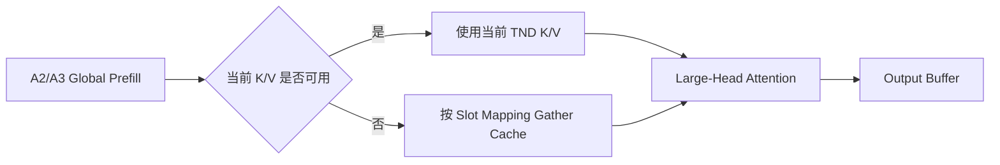

# 02 A2/A3/A5 适配过程

[上一篇：模型结构](01_模型结构分析.md) | [返回总览](README.md) | [下一篇：特性接入](03_特性接入情况.md)

## 1. 本篇做了什么

这一篇说明 Gemma4 在 A5 和 A2/A3 上分别采用什么 Attention 路径，以及适配过程中遇到的启动、Graph 和精度问题是怎样解决的。

| 设备 | 主要工作 | 当前方案 |
|---|---|---|
| A5 | 保留原生 FIA 256/512 head，修复 Graph Workspace 与 Layer Metadata | Sliding/Global 都走 FIA；Capture 缓存最大 Workspace；Replay 使用显式 Layer Identity |
| A2/A3 | 规避 FIA TND 不支持 512 head，保持 256-head FIA 性能 | Decode Global 走 PA；Prefill Global 走 Large-Head Fallback；Sliding 保留 FIA |
| 公共 Graph | 保证 Capture/Update/Replay 的 Backend、参数类型和 Metadata 一致 | PA 使用显式 Graph Param；FIA 使用 Layer-Aware Replay；Mask 与 Sparse Mode 保持一致 |

适配的核心不是让不同设备执行相同 kernel，而是在设备能力范围内保持相同的模型数学语义。

## 2. 整体分析与设计方法

### 2.1 先认识 A2、A3 和 A5

在 vLLM Ascend 的设备抽象中，A2、A3 和 A5 不是三个只靠名称区分的运行环境。它们代表不同代际和产品形态，算子能力、内存与通信组织、图执行实现也会随之变化。

| 设备 | 在本次适配中的定位 | Gemma4 关注点 |
|---|---|---|
| Atlas A2 | 已广泛部署的训练/推理产品，是适配和回归的重要基础平台 | FIA TND 不直接支持 512-dim Global Head，需要 PA/Prefill Fallback |
| Atlas A3 | 面向更大规模集群和高密度计算的后续平台 | 当前与 A2 共用大部分 Attention Fallback 语义，同时需要单独验证通信和 Graph |
| Ascend 950（A5） | 新一代昇腾产品，在本项目中提供更完整的 FIA Shape 能力 | 256/512-dim Head 均保留原生 FIA，适配重点转向 Workspace 和 Replay Metadata |

这里的区别不是简单的“新设备更快”。后端真正关心的是某个算子在某种 Layout、Head Size、Mask、Cache 和 Graph 模式下是否支持，以及 Capture 和 Replay 是否遵守相同契约。适配因此以能力检测和 DeviceAdaptor 为边界，而不是在模型代码里散落设备名称判断。

### 2.2 为什么分 A5 和 A2/A3 两条线

Gemma4 的 Sliding layer 使用 256 head dimension，Global layer 使用 512。A5 FIA 支持这两种 shape，A2/A3 的 FIA TND 当前不能直接处理 512 head。

如果把所有设备写成同一个分支，会出现两个问题：

- A5 被迫使用不必要的 PA/Fallback，损失原生 FIA 能力；
- A2/A3 误走 512-head FIA，在启动或运行阶段失败。

因此我们把模型语义与设备实现分开：

```text
Gemma4 Attention 语义
  -> 通用 Attention Forward
  -> DeviceOperator / DeviceAdaptor
       -> A5：原生 FIA
       -> A2/A3：512-head 窄范围 Fallback
```

### 2.3 适配顺序

我们按下面的顺序逐步增加复杂度：

1. A5 Eager：确认模型权重和 256/512-head FIA 基础语义。
2. A5 Graph：处理交错层 Workspace 和 Replay Metadata。
3. A2/A3 Eager：只为 512-head Global layer 增加 Fallback。
4. A2/A3 Graph：处理同一图内 PA/FIA 混合和参数更新。
5. Dense/MoE 对照：区分公共 Attention 与 MoE 通信问题。
6. 全量精度与 CI：确认短 Smoke 之外的长期生成稳定性。

这种顺序能保留清晰控制组，避免同时修改设备、Graph 和 MoE 后无法判断问题来源。

## 3. A5 适配

### 3.1 A5 做了什么

A5 的 FIA 可以执行 Gemma4 的 256-head Sliding Attention 和 512-head Global Attention，因此不需要 A2/A3 的 PA Fallback。

A5 路径设计为：

```text
Sliding layer, head=256
  -> FIA

Global layer, head=512
  -> FIA

Prefill / Decode
  -> 保持 FIA
```

这样可以减少 Backend 切换，也能充分使用 A5 的原生算子能力。真正的适配重点落在 ACLGraph：交错层虽然都调用 FIA，但 Workspace、Mask 和 Metadata 并不相同。

### 3.2 问题一：FIA Workspace 不足

#### 现象

A5 图模式启动时，在 `aclnnFusedInferAttentionScoreV5` 报错：

```text
Value 55664128 for parameter workspaceLen is invalid.
The passed workspace size 55664128 does not meet
the workspace size 104871936 actually required by the operator.
```

Python 调用栈位于 FIA Graph Capture/Task Group 结束阶段。Eager 模式正常，Graph 模式失败。

#### 分析

最初看起来像整卡显存不足，但报错中的两个值描述的是 FIA 的临时 Workspace，而不是模型权重或 KV Cache。

逐层对比后发现：

```text
相同 token bucket
  Sliding layer, head=256 -> 55,664,128 bytes
  Global  layer, head=512 -> 104,871,936 bytes
```

旧缓存只按 `num_tokens` 保存 Workspace。第一个进入 Capture 的 Sliding layer 写入较小值，后续 Global layer 复用同一块空间，于是出现 mismatch。

根因是旧逻辑隐含了下面的假设：

```text
相同 num_tokens -> 相同 Attention Workspace
```

Gemma4 的交错 Head Size 打破了这个假设。

#### 解决方案

我们评估过两种方案：

1. 每次 Replay 动态查询 Workspace；
2. Capture 阶段统计同一 bucket 的最大 Workspace，Replay 固定复用。

最终选择第二种：

```python
workspace_size[bucket] = max(
    workspace_size[bucket],
    current_layer_workspace_size,
)
```

#### 详细设计

- Workspace Query 只发生在 Capture 阶段，不进入 Decode Replay 热路径；
- 同一 token bucket 的 buffer 覆盖所有 256/512-head layer；
- 普通模型继续使用原缓存策略，不增加额外 Replay 开销；
- Workspace 地址和生命周期保持稳定，符合 Graph 静态复用要求。

#### 结果与收益

- A5 512-head Global FIA 不再因 Workspace 不足启动失败；
- 没有把 Global layer 回退到 PA 或 Eager；
- 避免每个 Decode Step 重算 Workspace；
- 影响范围限制在需要 Layer-Aware FIA Replay 的场景。

### 3.3 问题二：Graph 能启动，但输出重复或乱码

#### 现象

修复 Workspace 后，Graph 能够启动，但部分测试出现：

- 中文连续重复；
- 韩文或特殊符号；
- 长时间循环输出；
- Eager 正常，Graph 精度明显下降。

这说明问题不再是资源不足，而是 Capture/Replay 使用了错误状态。

#### 分析

旧逻辑会从 Attention Key 字符串中提取数字并排序，尝试恢复 Layer 顺序。这个方法依赖：

- Key 中第一个数字就是 Layer Index；
- Capture 顺序与模块字典顺序一致；
- Wrapper、Speculative 和 KV Sharing 不改变 Key；
- 当前执行 Layer 就是 Metadata Owner。

Gemma4 的交错 Attention、后续 E2B/E4B KV Sharing 和不同 Graph 路径使这些假设不再可靠。Global FIA 可能在 Replay 时拿到 Sliding layer 的 Metadata，例如错误的 `sliding_window`、Mask 或 KV 状态。

#### 解决方案

从“Replay 时猜 Layer”改成“Capture 时保存 Layer”：

```text
Capture
  -> 保存当前 FIA 对应的 layer_name
  -> KV Sharing 场景保存真正的 metadata/cache owner

Replay
  -> 按保存的 identity 获取 metadata
  -> 不依赖字符串排序
```

#### 详细设计

- Attention 实例保存 `_layer_name`；
- Graph Param 携带 Layer Identity；
- KV Sharing 使用 Producer/Target 语义确定 Metadata Owner；
- `needs_layer_aware_fia_graph_replay` 的判定结果缓存，避免反复读取配置；
- 非目标模型继续沿用原有 Replay 路径。

#### 结果与收益

- Global layer 不再错误复用 Sliding layer 的配置；
- Replay 参数来源可追踪，不依赖 Key 命名约定；
- Speculative、KV Sharing 等后续结构可以复用同一身份机制；
- 调试时可以明确记录“当前算子使用哪一层的 Metadata”。

### 3.4 问题三：A5 MoE Graph 精度下降

#### 现象

在相同 GPQA-D workload 下：

| 模式 | 典型结果 |
|---|---:|
| 26B MoE Eager | 约 73% |
| 26B MoE Graph + MC2/ALLTOALL | 约 57% |
| 26B MoE Graph + ALLGATHER | 约 73% |
| 31B Dense Graph | 约 77%–80% |

错误输出包括选项偏移、重复和 Max-Token 触顶。

#### 分析

我们使用了三组控制：

1. Dense Graph 正常，说明公共 Attention 并未普遍失效；
2. MoE Eager 正常，说明模型权重、Activation 和基础专家计算可用；
3. 只替换 MoE 通信 Backend 后精度恢复，把范围收敛到 Dispatch/Combine。

Padded Decode 回退曾使分数恢复到约 70%，但它同时改变 Graph 边界、Active Token 和调度，不能作为最终根因。ALLGATHER 仍然在 Graph 内执行，因此精度恢复不是整体退回 Eager。

#### 当前结论与边界

已确认问题高度集中在 A5 MoE Graph 的 MC2 组合路径，重点字段包括：

- Active/Padded Token；
- Expanded Row Index；
- Tokens Per Expert；
- Dispatch Token 顺序；
- Combine 输入和权重；
- Capture/Replay 动态 Metadata。

目前仍缺少逐字段对照来确认 MC2 内部的单一根因。ALLGATHER 是有效控制路径，但存在潜在通信性能代价，不能直接替代最终的 MC2 局部修复。

### 3.5 A5 当前结果

| 项目 | 状态 |
|---|---|
| 256-head FIA | 已支持 |
| 512-head FIA | 已支持 |
| FIA Graph Workspace | 已按 bucket 最大需求处理 |
| Layer-Aware Replay | 已接入 |
| Dense Eager/Graph | 已验证 |
| MoE Eager | 已验证 |
| MoE Graph | 可运行；MC2 路径仍需专项根因与性能验证 |

## 4. A2/A3 适配

### 4.1 A2/A3 做了什么

A2/A3 的主要差异是 FIA TND 当前不能直接执行 Gemma4 Global layer 的 512 head。我们没有关闭全模型 FIA，而是只替换不支持的 shape：

```text
Sliding, head=256
  -> FIA

Global Decode, head=512
  -> Paged Attention

Global Prefill/Chunked Prefill, head=512
  -> Large-Head Prefill Fallback
```

31B 只有 10/60 层是 Global，26B 只有 5/30 层是 Global。窄范围 Fallback 能保留大部分 Sliding layer 的 FIA 性能。

### 4.2 为什么 Decode 选择 PA

Decode 每一步通常只产生一个新 Token，历史 K/V 已保存在 Paged KV Cache。PA 可以通过 Block Table 直接访问历史块：

```text
Query token
  + Block Table
  + Paged K/V Cache
  -> Paged Attention
```

因此，A2/A3 在 `DecodeOnly`、Global 512 head 场景下进入 `forward_paged_attention`。这个方案既规避 FIA 能力缺口，也保留增量解码的 KV Cache 优势。

### 4.3 为什么 Prefill 需要独立 Fallback

Prefill 和 Chunked Prefill 同时处理多个 Query Token，不能简单套用单 Token PA。Large-Head Prefill Fallback 需要：

1. 确认当前 K/V 是连续输入还是来自 Cache；
2. 必要时根据 Slot Mapping 从 Paged Cache Gather；
3. 构造正确的 TND Q/K/V；
4. 使用支持 Large Head 的 Attention 实现；
5. 将结果写回原 Output Buffer。



Decode 和 Prefill 的 Fallback 分开设计，是因为两者的数据布局和 Attention State 不同。Head Size 只说明设备能力，Attention State 决定具体执行方式。

### 4.4 DeviceAdaptor 的设计

设备差异放到 DeviceOperator/DeviceAdaptor，而不是堆在 `attention_v1.py`：

```text
attention_v1.py
  -> 调用统一设备接口

Base Device Path
  -> A2/A3 512-head Prefill Fallback

A5 Device Adaptor
  -> 原生 FIA
```

这样做有几个收益：

- 通用 Attention Forward 不感知 SOC；
- A5 不会误走 A2/A3 Fallback；
- Fallback 可以单独测试；
- 新设备只需提供自己的接口实现；
- 其他模型已支持的 shape 不发生变化。

### 4.5 问题一：Mixed PA/FIA Graph 参数错配

#### 现象

A2/A3 Eager 打通后，Graph 启动报错：

```text
ValueError: not enough values to unpack (expected 21, got 9)
```

PA Capture 保存 9 项参数，FIA Capture 保存另一组约 21 项参数。错误发生在 `update_graph_params`。

#### 分析

同一张 Gemma4 Decode Graph 中存在：

```text
Sliding layer, head=256 -> FIA
Global  layer, head=512 -> PA
Sliding layer, head=256 -> FIA
```

Capture 根据 `head_size=512` 正确选择 PA，却在 Update 阶段重新使用不完整的全局条件判断，最终把 PA 参数当成 FIA 参数解包。

问题不是 tuple 少字段，而是：

```text
Capture Backend != Replay Update 识别出的 Backend
```

#### 为什么不使用 `len(param)`

下面这种修复虽然短，但不可维护：

```python
if len(param) in (9, 10):
    ...
```

Tuple 长度只是实现细节。增加 Layer Name、Draft Step 或新字段后，魔术数字会再次失效，也无法直接表达 PA/FIA 的语义。

#### 解决方案

使用显式 `PagedAttentionGraphParam`：

```text
PA Capture
  -> PagedAttentionGraphParam(params, layer_name)

FIA Capture
  -> FIA Graph Param

Replay Update
  -> 按显式类型分派
```

PA Update 只更新 Replay 期变化的数据：

- Query/Output Buffer；
- Block Table；
- Sequence Length；
- Draft Step 对应 Metadata；
- Layer Identity。

#### 结果与收益

- Mixed PA/FIA Graph 不再发生 9/21 解包错误；
- Capture 与 Update 使用同一 Backend Identity；
- 不依赖 Tuple 长度；
- 新增字段不会静默改变分派逻辑；
- 非 Mixed-Backend 模型仍使用原有路径。

### 4.6 问题二：Large-Head RoPE UB 溢出

#### 现象

512-head Fallback 进入 RoPE Kernel 后出现局部 UB 超限：

```text
required:  1,581,056 bits
available: 1,572,864 bits
overflow:      8,192 bits
```

这个错误与整卡 HBM 无关。增加内存利用率或减少 KV Cache 不会改变 Kernel 单个 Program 的局部 UB。

#### 分析

RoPE Triton Kernel 按 `BLOCK_SIZE_HEAD` 处理 Head Tile。局部工作集近似为：

$$
\mathrm{UB}
\propto
\mathrm{BLOCK\_TOKENS}
\times \mathrm{BLOCK\_HEAD}
\times \mathrm{dtype\ bytes}
\times \mathrm{temporary\ factor}
$$

Head Dimension 增大后，Q/K、Sin/Cos 和临时 Tensor 同时占用更多 UB。

#### 解决方案

对 `head_dim>=256` 将 Head Tile 从 64 减小到 16：

- 数学计算不变；
- 单个 Program 的局部 UB 降低；
- Program 数量增加；
- 可能增加少量 Kernel 调度开销。

条件绑定真实 Shape，而不是绑定 Gemma4 模型名称，因此能表达设备资源边界，也方便其他 Large-Head 模型复用。

### 4.7 A2/A3 当前结果

| 项目 | 状态 |
|---|---|
| Sliding 256-head FIA | 已保留 |
| Global 512-head Decode | 已使用 PA |
| Global 512-head Prefill | 已使用 Large-Head Fallback |
| Mixed PA/FIA Graph | 已使用显式参数类型 |
| Large-Head RoPE UB | 已通过减小 Tile 解决 |
| Dense/MoE Eager/Graph | 已建立 PR/Nightly 看护 |

## 5. A2/A3/A5 共用的 Graph 设计

### 5.1 Capture、Update 与 Replay

Capture 可以理解为记录一次完整执行：

- 算子顺序；
- Tensor Address 或可更新 Buffer；
- Workspace；
- Handle/Event；
- Attention Metadata。

Replay 前只更新本轮变化的数据：

```text
New Query / KV State / Block Table / Seq Lens
  -> Update Graph Params
  -> Replay Captured Tasks
  -> Read Output
```

Replay 不重新执行全部 Python 分支，因此 Capture 时选错 Backend、Layer、Mask 或 Cache Owner，错误会被后续每个 Step 重复执行。

### 5.2 必须保持的 Graph 不变量

设 $l$ 为 Layer，$b$ 为 Token Bucket：

$$
\mathrm{Backend}_{capture}(l,b)
=\mathrm{Backend}_{replay}(l,b)
$$

$$
\mathrm{MetadataOwner}_{capture}(l)
=\mathrm{MetadataOwner}_{replay}(l)
$$

$$
\mathrm{Workspace}_{cached}(b)
\ge \max_l \mathrm{WorkspaceRequired}(l,b)
$$

此外还需要保证：

```text
Mask / Sparse Mode / Sliding Window 语义一致
PA/FIA Graph Param 类型明确
KV-Sharing Target 不覆盖 Producer Cache
Draft/Target Step 使用正确 Metadata
```

### 5.3 FIA Decode Mask 回归

一次主干变更同时修改了 FIA Eager、Capture 和 Replay 的 Mask/Sparse-Mode 参数。接口仍能正常调用，服务也能启动，但 A2 MoE Nightly 出现：

| 状态 | GPQA-D | Loop Rate |
|---|---:|---:|
| 回归后 | 46.97% | 27.3% |
| 恢复旧语义后 | 72.22% | 2.5% |

排查时我们先按提交建立时间线，再对比回归前后的 Attention 参数。完整恢复 Mask 行为后，精度和重复率同时恢复，确认问题来自参数语义变化，而不是 Router Replacement 或 Weight Layout。

这个案例说明：Graph 正确性不只是参数数量和类型正确，每一个参数值也必须符合模型与算子契约。

## 6. 关键代码边界

| 文件 | 责任 |
|---|---|
| `vllm_ascend/attention/attention_v1.py` | 通用 Attention Forward、Capture/Replay 接入 |
| `vllm_ascend/attention/utils.py` | PA Graph Param、Workspace、Layer-Aware 判定、PA 决策 |
| `vllm_ascend/device/device_op.py` | 统一设备 Attention 接口与 A5 Override |
| `vllm_ascend/device/utils.py` | Large-Head Prefill 与 Paged KV Gather |
| `vllm_ascend/ops/rotary_embedding.py` | Large-Head RoPE Tile |
| `vllm_ascend/compilation/acl_graph.py` | Graph 生命周期、参数更新与 Replay |

代码边界遵循以下原则：

- 模型语义留在模型和通用 Attention 层；
- SOC 差异放在 DeviceAdaptor；
- Graph 参数类型放在 Attention Utils；
- Kernel Resource 调整放在具体算子实现；
- 不在通用 Forward 中堆叠模型名称判断。

## 7. 适配演进与参考 PR

| PR | 主要作用 | 关键设计 |
|---|---|---|
| [#9222](https://github.com/vllm-project/vllm-ascend/pull/9222) | 早期参考 | 提供 Attention、MoE、RoPE 和 Runner 的问题拆解思路 |
| [#10643](https://github.com/vllm-project/vllm-ascend/pull/10643) | A5 支持 | Layer-Aware Replay、Max Workspace、GELU |
| [#11091](https://github.com/vllm-project/vllm-ascend/pull/11091) | A2/A3 512 Head | Decode PA、Prefill Fallback、DeviceAdaptor |
| [#11536](https://github.com/vllm-project/vllm-ascend/pull/11536) | A2/A3 Graph | 显式 PA Param、Mixed Replay、RoPE UB |
| [#11791](https://github.com/vllm-project/vllm-ascend/pull/11791) | E2B/E4B | KV-Sharing Target 不写 Cache |
| [#12228](https://github.com/vllm-project/vllm-ascend/pull/12228) | 恢复 PA 依赖 | 保证 A2/A3 512-head Decode Fallback 可达 |
| [#12605](https://github.com/vllm-project/vllm-ascend/pull/12605) | 精度恢复 | 恢复 FIA Decode Mask 语义 |

早期 PR 可以参考模型语义和问题分解，但不能整段复制。主干 Attention API、Graph Param 和 DeviceAdaptor 已经演进，最终实现必须按当前接口重新设计。

## 8. 当前结果与后续工作

### 已完成

- A5 256/512-head 原生 FIA 路径；
- A5 Graph Workspace 与 Layer-Aware Replay；
- A2/A3 512-head Decode/Prefill Fallback；
- A2/A3 Mixed PA/FIA Graph；
- Large-Head RoPE UB 修复；
- FIA Decode Mask 精度回归修复；
- Dense/MoE 的 PR E2E 与 Nightly 基线。

### 仍需继续验证

- A5 MoE MC2 Graph 的具体动态字段根因；
- E2B/E4B KV Sharing 的全量 Graph 精度；
- 不同设备与量化组合下的长上下文；
- MTP 与 PA/FIA、MoE、KV Sharing 的组合路径。

### 修改相关代码时需要回归

```text
修改 Attention Backend -> 验证 31B/26B Eager 与 Graph
修改 PA/FIA Param -> 验证 Mixed Backend 和 Draft Model
修改 Cache Write -> 验证 E2B/E4B Producer/Target
修改 Mask/Sparse Mode -> 跑 MoE 全量精度
修改 Workspace -> 检查相同 Bucket 的 256/512 Head
修改 DeviceAdaptor -> 分别验证 A2/A3/A5
```
