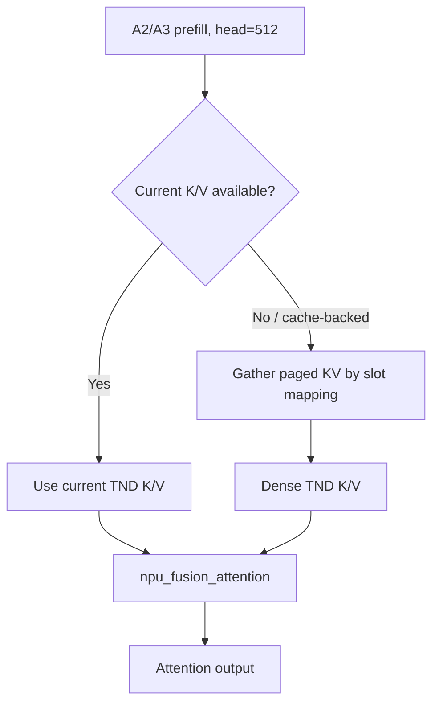
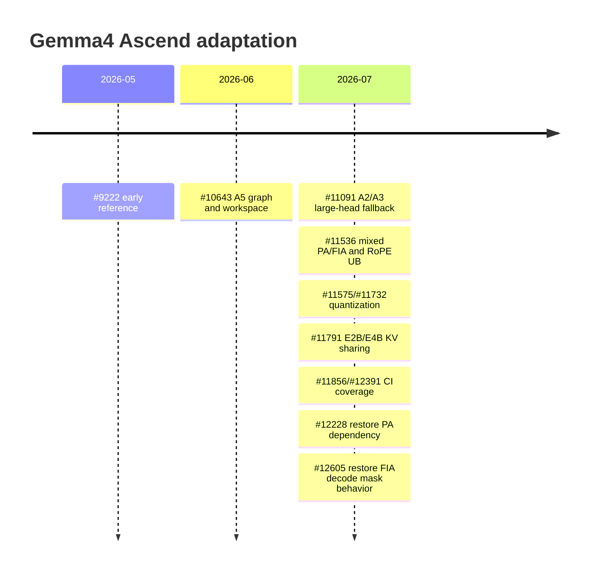

# 02 A2/A3/A5 适配过程

[上一篇：模型结构](01_模型结构分析.md) | [返回总览](README.md) | [下一篇：特性接入](03_特性接入情况.md)

## 1. 设计目标

同一 Gemma4 模型在 A2/A3/A5 上必须保持相同数学语义，但不要求使用完全相同的 kernel。设备适配层负责将“执行 attention”映射到该设备可用的实现：

```text
model semantics
    -> common attention forward
    -> DeviceAdaptor
    -> A2/A3 fallback or A5 native FIA
```

核心原则是：**attention 主流程不感知具体 SOC 的算子能力表**。

## 2. 能力矩阵

| 能力 | A2/A3 | A5 |
|---|---|---|
| FIA TND head 256 | 支持 | 支持 |
| FIA TND head 512 | 当前使用 fallback | 支持 |
| 512-head decode | PA | FIA |
| 512-head prefill | large-head fallback | FIA |
| Mixed PA/FIA graph | 必需 | 框架兼容，但 Gemma4 通常不因 512 head 切 PA |
| FIA workspace | 常规缓存 | 交错层需 max workspace |
| MoE graph 通信 | A2/A3 路径 | A5 MC2 组合路径曾有精度风险 |

## 3. A2/A3 512-head fallback

### 3.1 为什么只 fallback global layer

31B 只有 10/60 层是 global，26B 只有 5/30 层是 global。若全模型关闭 FIA：

- 绝大多数 sliding layer 丢失 FIA 性能；
- 改变更多已有模型路径；
- 无法遵循最小影响原则。

因此 fallback 条件由 `head_size==512` 表达。A5 在设备实现中覆盖接口，继续使用 FIA。

### 3.2 Decode：PA

DecodeOnly 下，A2/A3 global layer：

```text
using_paged_attention(runtime_shape, config, head_size=512)
    -> True
    -> forward_paged_attention
```

PA 直接从 paged KV cache 读取历史 K/V，适合单步 decode。

### 3.3 Prefill：large-head attention

Prefill/Chunked Prefill 的输入包含多个 query token，不能简单复用单 token PA。DeviceAdaptor 对 512 head：

1. 解析当前 K/V 来源；
2. 必要时根据 slot mapping 从 paged cache gather；
3. 构造连续 TND K/V；
4. 调用 large-head prefill attention；
5. 保持输出写入原 output buffer。



### 3.4 DeviceAdaptor 边界

`BaseDeviceAdaptor.npu_fused_infer_attention_score` 可对 A2/A3 512 head 执行 fallback；`A5DeviceAdaptor` 直接调用 A5 FIA。这样：

- `attention_v1.py` 不包含 A2/A3/A5 判断；
- 设备差异可单独测试；
- A5 不会误走 A2 fallback；
- 新设备可以新增 adaptor，而不继续膨胀 attention forward。

## 4. Mixed PA/FIA graph

### 4.1 为什么同一图中会混合 backend

A2/A3 Gemma4 decode graph：

```text
sliding layer (256) -> FIA
global layer  (512) -> PA
sliding layer (256) -> FIA
...
```

因此一个 graph bucket 的 `attn_params[num_tokens]` 同时存放两种参数结构。

### 4.2 旧错误

PA capture 记录 9 个字段，FIA capture 记录约 21 个字段。旧 replay update 用全局条件判断参数类型，可能将 PA tuple 当 FIA 解包：

```text
ValueError: not enough values to unpack (expected 21, got 9)
```

根因不是“tuple 少了字段”，而是 **capture backend 与 replay dispatch 语义不一致**。

### 4.3 为什么不能使用 `len(param)`

```python
if len(param) in (9, 10):
    ...
```

存在以下问题：

- tuple 长度是实现细节；
- 新增字段会静默改变 dispatch；
- 9 和 21 无法表达 PA/FIA 语义；
- 代码审查无法证明所有长度组合；
- draft model 或 layer name 扩展会继续增加 magic number。

### 4.4 显式参数类型

`PagedAttentionGraphParam` 将原 PA tuple 与 layer identity 封装：

```text
PA capture -> PagedAttentionGraphParam
FIA capture -> FIA graph param
replay -> dispatch by explicit type
```

PA update 只更新 replay 期会变化的数据，如：

- block table；
- sequence lengths；
- query/output buffer；
- draft step 对应 metadata。

参数 wrapper 不改变 PA kernel 数学语义，只消除 replay 对外部全局条件的猜测。

## 5. Graph capture/replay 原理

### 5.1 Capture

Capture 记录：

- operator sequence；
- static tensor addresses 或可更新 input buffer；
- kernel/task group；
- workspace；
- graph handle/event；
- attention metadata snapshot。

### 5.2 Replay

Replay 前需要把本轮请求数据写入 capture 期 buffer：

```text
new query / KV cache state / block table / seq_lens
    -> update graph params
    -> replay graph
    -> read output
```

Replay 不重新执行 Python control flow，因此 capture 时选错 backend、layer 或 mask 后，运行时可能持续稳定地执行错误图。

### 5.3 同构要求

$$
\mathrm{Backend}_{capture}(l,b)
=\mathrm{Backend}_{replay}(l,b)
$$

$$
\mathrm{MetadataOwner}_{capture}(l)
=\mathrm{MetadataOwner}_{replay}(l)
$$

$$
\mathrm{Workspace}_{cached}(b)
\ge \max_l \mathrm{WorkspaceRequired}(l,b)
$$

其中 $l$ 为 layer，$b$ 为 token bucket。

## 6. A5 FIA workspace

### 6.1 失败

```text
passed workspace:   55,664,128 bytes
required workspace: 104,871,936 bytes
```

### 6.2 根因

同一 `num_tokens` bucket 中，256/512 head FIA 的 workspace 不同。若先 capture sliding layer 并缓存较小 workspace，global layer replay 就不足。

### 6.3 不采用 replay 动态重算

每次 replay 查询 workspace 虽然安全，但会：

- 增加 host 开销；
- 改变所有模型原有路径；
- 让 workspace 生命周期更复杂；
- 增加 graph replay 时序风险。

### 6.4 最终策略

Capture 阶段保存同 bucket 的最大候选空间：

```python
cached_size[bucket] = max(cached_size[bucket], candidate_size)
```

Replay 固定复用，不再动态查询。

普通模型保持原首次缓存策略，只有需要 layer-aware FIA replay 的模型使用 max 策略，控制影响面。

## 7. Layer-aware metadata replay

### 7.1 旧的 key 排序

旧方案从 attention key 中抽取数字后排序，隐含：

- 第一个数字就是 layer index；
- key 顺序与 forward 顺序一致；
- wrapper、speculative、KV sharing 不改变 key；
- metadata owner 等于当前 layer。

Gemma4 不满足全部假设。

### 7.2 显式 layer identity

Capture 时记录：

```text
current layer name
or
KV-sharing metadata/cache owner
```

Replay 按记录的 identity 读取 metadata，不依赖字典顺序或正则排序。

### 7.3 KV sharing 的特殊性

E2B/E4B 中：

```text
executing layer != KV producer
```

graph param 中保存的 layer identity 必须表达“本算子更新哪一份 metadata/cache”，而不只是当前 module 名称。

## 8. A2/A3 RoPE UB

### 8.1 原理

Triton program 以 `BLOCK_SIZE_HEAD` 处理 head tile。局部 UB 工作集近似随：

$$
\mathrm{UB}
\propto \mathrm{BLOCK\_TOKENS}
\times \mathrm{BLOCK\_HEAD}
\times \mathrm{dtype\ bytes}
\times \mathrm{temporary\ factor}
$$

head 256/512 时，大 tile 会同时放大 Q/K、sin/cos 和中间 tensor。

### 8.2 观察

```text
required:  1,581,056 bits
available: 1,572,864 bits
overflow:      8,192 bits
```

### 8.3 修复

对 `head_dim>=256` 将 head tile 从 64 减小到 16：

- 数学计算不变；
- 每个 program 的 UB 降低；
- program 数增加；
- 可能带来轻微 kernel latency 成本。

## 9. FIA decode mask 与 sparse mode

Graph 与 eager 必须对同一 attention 状态使用相同：

- `atten_mask`；
- `sparse_mode`；
- `pre_tokens/next_tokens`；
- sliding window。

#11266 同时改变普通 FIA、capture 和 replay 的 mask/sparse mode。它在接口一致性上看似完整，但对 Gemma4 MoE 产生严重行为回归。#12605 完整恢复旧语义。

这说明 graph 正确性不仅是“参数数量相同”，更是参数值必须符合模型和算子契约。

## 10. A5 MoE graph 通信

A5 MoE graph 的实验中：

- MC2/ALLTOALL 路径约 57%；
- ALLGATHER 对照约 73%；
- 31B Dense graph 正常。

ALLGATHER 仍在 graph 中执行，因此结果表明精度恢复并非来自“整体回落到 eager 执行”。最可能的范围是：

- active/padded token；
- dispatch index；
- tokens-per-expert；
- expanded row index；
- combine 输入；
- capture/replay 动态 metadata。

现有证据尚不足以确认 MC2 内部的单一字段。

## 11. Attention 路径伪代码

```python
if decode_only and using_paged_attention(runtime_shape, config, head_size):
    # A2/A3 512-head decode or configured PA shape.
    output = forward_paged_attention(...)
else:
    # DeviceAdaptor selects native FIA or A2/A3 512-head prefill fallback.
    output = DeviceOperator.npu_fused_infer_attention_score(...)
```

注意：真实代码还需处理 cache、capture、quant 和 attention state。伪代码用于说明分支责任，不应直接替换实现。

## 12. 设备/图执行不变量

```text
1. A2/A3 只 fallback 不支持的 512-head shape
2. A5 继续使用原生 FIA
3. PA/FIA graph 参数按显式类型 dispatch
4. capture/replay layer identity 一致
5. workspace 对 bucket 内所有 layer 足够
6. mask/sparse mode 在 eager/capture/replay 语义一致
7. KV-sharing target 不写 producer cache
8. DeviceAdaptor 不改变普通模型已支持的 shape
```

## 13. 分设备适配闭环

### 13.1 A5

适配顺序：

```text
确认 FIA 支持 256/512 head
  -> 保持 full/sliding 都走 FIA
  -> 发现相同 bucket 的 workspace 需求不同
  -> capture 期缓存最大 workspace
  -> 发现 replay metadata 不能靠 key 排序
  -> capture 显式 layer/cache owner
  -> 补齐 GELU-TANH 和 routing config
  -> Dense graph 作为 attention 控制组
  -> MoE graph 用 ALLGATHER/MC2 A/B 定位通信问题
```

A5 不需要 A2/A3 的 512-head PA fallback。若 A5 global layer 意外走 PA，应检查：

- device adaptor 是否正确注册；
- `using_paged_attention` 是否错误绕过 A5；
- 配置是否启用了特定 PA shape；
- 代码是否把“非 A5”简单等同为某一设备。

### 13.2 A2/A3

适配顺序：

```text
确认 FIA TND 512 不支持
  -> decode global layer 走 PA
  -> prefill global layer走 large-head fallback
  -> sliding 256 layer保留 FIA
  -> 解决同一图 PA/FIA 参数混合
  -> 修复 large-head RoPE UB
  -> 依赖 PA 代码保持在主干
  -> 通过 PR smoke + nightly 验证
```

该路径有三个独立正确性条件：

1. backend 选择正确；
2. graph 参数分派正确；
3. fallback 的数学结果与 FIA 语义一致。

只解决其中一个不能称为完整适配。

### 13.3 共同路径

A2/A3/A5 共同依赖：

- model layer type；
- K=V；
- MoE activation；
- layer-aware metadata；
- KV-sharing cache owner；
- FIA decode mask；
- graph input update。

设备分支越靠近 kernel/adaptor，通用语义越容易共享。

## 14. 关键文件

| 文件 | 责任 |
|---|---|
| `vllm_ascend/attention/attention_v1.py` | 通用 attention 主流程、capture/replay 接入 |
| `vllm_ascend/attention/utils.py` | PA graph param、workspace、layer-aware 判定、PA 决策 |
| `vllm_ascend/device/device_op.py` | 设备 attention 接口和 A5 override |
| `vllm_ascend/device/utils.py` | large-head prefill、paged KV gather |
| `vllm_ascend/ops/rotary_embedding.py` | large-head RoPE tile |
| `vllm_ascend/compilation/acl_graph.py` | graph 生命周期、参数更新和 replay |

## 15. 适配演进与关键 PR



| PR | 作用 | 关键设计 |
|---|---|---|
| [#9222](https://github.com/vllm-project/vllm-ascend/pull/9222) | 早期参考 | 提供 attention、MoE、RoPE、runner 思路；未整体照搬 |
| [#10643](https://github.com/vllm-project/vllm-ascend/pull/10643) | A5 支持 | Layer-aware replay、max workspace、GELU |
| [#11091](https://github.com/vllm-project/vllm-ascend/pull/11091) | A2/A3 512 head | Decode PA、prefill fallback、DeviceAdaptor |
| [#11536](https://github.com/vllm-project/vllm-ascend/pull/11536) | A2/A3 graph | 显式 PA param type、mixed replay、RoPE UB |
| [#11791](https://github.com/vllm-project/vllm-ascend/pull/11791) | E2B/E4B | KV-sharing target 不写 cache |
| [#12228](https://github.com/vllm-project/vllm-ascend/pull/12228) | 恢复 PA | 保证 A2/A3 512-head decode fallback 可达 |
| [#12605](https://github.com/vllm-project/vllm-ascend/pull/12605) | 精度恢复 | 完整恢复 #11266 前的 FIA decode mask 语义 |

### 15.1 为什么不能直接复制 #9222

- 主干 attention API 已演进；
- A5 支持 FIA 512，不应采用 A2/A3 规避；
- graph param/workspace 抽象变化；
- 设备差异应进入 DeviceAdaptor；
- 最终代码需与当前 vLLM 接口和 CI 对齐。

可复用的是问题分解和模型语义，不是旧实现的全部代码。

## 16. 维护时必须检查

```text
修改 attention backend -> 运行 31B/26B graph
删除 PA -> 检查 A2/A3 512-head fallback
修改 graph param -> 检查 PA/FIA 和 draft model
修改 cache write -> 检查 E2B/E4B
修改 mask/sparse mode -> 跑 MoE 全量精度
修改 workspace -> 检查同 bucket 256/512 head
修改 device adaptor -> 验证 A2/A3/A5 不同路径
```
