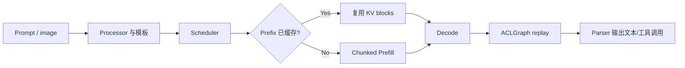

# 03 特性接入情况

[上一篇：A2/A3/A5 适配过程](02_A2_A3_A5适配过程.md) | [返回总览](README.md) | [下一篇：量化适配](04_量化适配.md)

## 1. 本篇做了什么

在模型基础推理和设备 Attention 路径打通后，我们继续验证 Gemma4 作为在线服务需要的运行时能力。

| 特性类别 | 接入内容 | 主要收益 |
|---|---|---|
| 输入输出 | Multimodal、Tool Parser、Reasoning Parser | 支持图片等输入和结构化输出 |
| 调度缓存 | Chunked Prefill、Prefix Cache、Async Scheduling | 改善长请求调度、重复前缀和 Host/Device 重叠 |
| 设备优化 | ACLGraph、Weight NZ、CPU Binding、FlashComm1 | 减少 Launch、格式转换和 Host/通信开销 |
| 分布式与扩展 | Expert Parallel、MTP 相关组合 | 扩展 MoE 专家容量和 Decode 优化空间 |
| 长期看护 | PR Smoke、Nightly GPQA-D | 防止启动、Graph 和精度回归 |

## 2. 为什么需要单独做特性接入

“模型能够生成文本”只覆盖最基础路径。完整接入需分为四层：

1. **模型接口层**：multimodal processor、tool parser、reasoning parser、chat template。
2. **调度与缓存层**：chunked prefill、prefix cache、async scheduling。
3. **设备优化层**：ACLGraph、weight NZ、CPU binding、通信融合。
4. **扩展推理层**：量化、MTP、expert parallel。

不同特性的正确性标准不同。例如 prefix cache 需要命中 metrics，CPU binding 需要进程亲和性证据，ACLGraph 需要 capture/replay 日志和精度对照，不能只用“12 个请求成功”作为所有特性的统一证明。

适配过程中主要遇到四类问题：

1. **配置可以解析，但功能没有真正生效。** 例如开关被接受，却没有对应日志、Metric 或执行路径。
2. **功能请求成功，但没有带来预期收益。** Chunked Prefill 在小样本串行场景甚至可能略慢。
3. **Eager 支持，但 Graph 组合失败。** 动态 Buffer、Cache 和通信在 Replay 中有额外约束。
4. **单特性支持，但组合不一定支持。** Prefix Cache、Chunked Prefill、EP、量化和 Graph 需要组合验证。

## 3. 我们如何分析和验证特性

### 3.1 从一次请求理解这些特性

把一次用户请求放进系统，就能更直观地看见各项特性的职责：



- Processor 和 parser 解决“输入输出协议是否正确”；
- Chunked Prefill 和 Prefix Cache 解决“首 token 前的工作怎样调度和复用”；
- ACLGraph 解决“每个 decode step 的 host 发射开销”；
- Weight NZ、通信融合和 CPU Binding 解决“数据怎样更高效地在设备与主机上移动”；
- EP 和 MTP 则分别改变“专家如何分布”和“一次 target step 能推进多少 token”。

这些优化处在不同层次，因此不会互相替代。例如 Prefix Cache 命中无法修复 KV-sharing layer 的 cache owner，ACLGraph 也不能修复错误的 GELU/SwiGLU 语义。

### 3.2 统一验证方法

每项特性都按五个问题检查：

```text
做了什么：打开哪个配置，进入哪条代码路径
为什么做：它解决请求生命周期中的哪一段成本或能力
原理是什么：调度、缓存、Graph、格式或通信怎样变化
怎样证明：日志、Metric、输出、精度或性能使用什么证据
边界是什么：在哪些设备、模式和组合下还没有验证
```

功能、精度和性能分开判断：

- 请求成功只能证明基础功能；
- Eager/Graph 对照用于证明执行模式；
- 全量精度用于证明模型语义；
- 固定 Workload A/B 用于证明性能收益。

## 4. Multimodal 接入

Gemma4 支持文本、图片、音频和视频输入。vLLM 接入包含：

- 输入 schema；
- dummy input builder；
- multimodal processor；
- encoder 输出尺寸估计；
- placeholder 与 text token merge；
- model runner 中的 embedding buffer；
- multimodal limit 配置。

典型服务参数：

```bash
--limit-mm-per-prompt '{"image":2,"audio":1,"video":1}'
```

### 4.1 为什么多模态会影响 Attention

图片/音频/video embedding 会扩展 prefill token 序列，影响：

- `num_tokens` 和 graph bucket；
- block table 与 KV cache 占用；
- chunked prefill 切分；
- TTFT；
- prefix cache 可复用范围；
- PLE static buffer；
- 量化性能。

因此文本验证通过不等于多模态验证完成。性能基线至少应包含一组图片输入。

## 5. Tool Parser 与 Reasoning Parser

Gemma4 服务常用：

```bash
--enable-auto-tool-choice
--tool-call-parser gemma4
--reasoning-parser gemma4
```

它们属于输出协议层，不直接改变 attention kernel，但会改变：

- prompt template；
- 特殊 token；
- reasoning 与 final answer 的切分；
- tool-call JSON 的解析和终止；
- 精度评测时的答案抽取。

排查“答案字母错误”时，应先区分：

- 模型 logits 已错误；
- parser 把正确文本解析成错误答案；
- chat template 与官方模板不同；
- reasoning 被截断。

## 6. Chunked Prefill

### 6.1 原理

长 prompt prefill 通常 compute-heavy。Chunked Prefill 将一个长 prefill 拆到多个 scheduler step：

```text
long prefill: [0 ................. N]
chunked     : [0..C] [C..2C] [2C..N]
```

每个 step 的 token budget 受 `max_num_batched_tokens` 约束。这样 decode 请求或短 prefill 可以插入调度，减少长请求对队列的阻塞。

### 6.2 主要收益

- 混合 prefill/decode 负载的尾延迟更稳定；
- 避免单个超长 prefill 独占一个调度步；
- 更容易控制瞬时显存和算子 shape。

它不保证单请求平均延迟一定下降。小样本串行请求下，分块和调度开销甚至可能让平均耗时略高。

可以把 Chunked Prefill 想成把一辆很长的货车拆成几批通行。单看这辆车，分批可能多几次调度；但在繁忙路口，短请求和 decode 请求不必一直等到整辆长车通过，系统尾延迟会更稳定。因此它的价值要在混合负载和 p95/p99 中观察，而不是只看一个长 prompt 的平均耗时。

### 6.3 Gemma4 验证

验证配置：

```bash
--enable-chunked-prefill
--max-num-batched-tokens 2048
```

31B 与 26B MoE 均完成 12/12 请求。报告中的 mean latency：

| 模型 | Baseline | Chunked Prefill |
|---|---:|---:|
| 31B | 2.737 s | 2.950 s |
| 26B MoE | 3.116 s | 3.159 s |

这组数字只证明轻量功能验证中没有性能收益，不能否定它在混合负载 p95/p99 上的价值。

### 6.4 已知限制

性能报告对应构建的 Ascend backend 不支持 `--max-num-partial-prefills>1` 的 Concurrent Partial Prefill。它与普通 Chunked Prefill 不是同一个能力：

- 普通 chunked：一个 partial prefill 按多个 step 推进；
- concurrent partial prefill：同时调度多个 partial prefill。

文档和测试不能把两者混称。

## 7. Prefix Cache / APC

### 7.1 原理

Automatic Prefix Caching 将已经完成 prefill 的 KV block 按 token prefix 进行缓存。新请求若共享前缀，可跳过重复 prefill：

```text
Request A: [system prompt][document][question A]
Request B: [system prompt][document][question B]
            ^ shared prefix reused
```

理想情况下：

$$
\mathrm{TTFT}_{cached}
\approx \mathrm{TTFT}_{full}
- \mathrm{PrefillCost}(\mathrm{shared\ prefix})
$$

实际收益还受 hash、block 对齐、cache eviction 和尾部非共享 token 影响。

### 7.2 验证证据

有效验证至少需要：

- 配置中 `enable_prefix_caching=True`；
- `/metrics` 中 query/hit counter；
- 构造共享前缀 workload；
- 命中率和 TTFT 对照。

实测：

| 模型 | Queries | Hits | 命中率 | Shared TTFT | Random TTFT | 改善 |
|---|---:|---:|---:|---:|---:|---:|
| 31B | 140270 | 121344 | 86.5% | 1.96 s | 2.26 s | -13.2% |
| 26B MoE | 140092 | 121088 | 86.4% | 2.13 s | 2.38 s | -10.4% |

这里的收益来自“少算了共享前缀”，并不是 attention kernel 本身变快。共享前缀越长、cache 越稳定、block 对齐越好，收益通常越明显；如果请求前缀几乎都不同，打开 Prefix Cache 也不会凭空降低 TTFT。

### 7.3 与 KV Sharing 的区别

两者都叫“复用 KV”，但作用层次完全不同：

- Prefix Cache：请求之间复用相同 token prefix 的 KV block；
- E2B/E4B KV Sharing：同一次模型前向中，target layer 复用 producer layer 的 KV。

前者属于 scheduler/cache manager，后者属于模型结构。不能用 prefix cache 开关修复 layer KV sharing。

## 8. Weight NZ

### 8.1 原理

NZ 是更适合 Ascend 矩阵计算的数据布局。它通过重排权重，减少运行时 format conversion 或改善 cube 访问效率。

`weight_nz_mode` 常见语义：

- `0`：关闭；
- `1`：仅量化场景启用；
- `2`：BF16/FP16 也启用。

### 8.2 Gemma4 验证

31B 与 26B MoE 使用：

```bash
--additional-config '{"weight_nz_mode": 2}'
```

均完成 12/12 请求，日志确认 mode 2 生效。26B 同时验证了 Weight NZ 与 MoE/EP 组合。

该测试证明格式路径可用，不证明一定有性能收益。性能收益需要相同 workload 下 mode 0/2 的 profiler 对照。

## 9. Async Scheduling

### 9.1 原理

同步调度中，host 生成下一步调度数据与 device 执行可能串行：

```text
Host schedule -> Device execute -> Host schedule -> Device execute
```

异步调度尝试重叠：

```text
Host schedule step n+1
        overlaps
Device execute step n
```

收益取决于 host scheduling 是否成为瓶颈。它通常不会改变模型数学语义，但可能暴露：

- buffer 生命周期错误；
- stream/event 同步遗漏；
- graph input 更新时序问题。

### 9.2 验证

31B 和 26B 均通过 12/12 请求，未出现 hang。轻量 mean latency 与 baseline 接近，不能据此评估吞吐收益。

## 10. CPU Binding

### 10.1 原理

CPU binding 将 worker、runtime thread 和内存访问尽量约束到与 NPU 拓扑接近的 CPU/NUMA node：

- 减少跨 NUMA 访存；
- 降低 scheduler migration；
- 改善 host-to-device feeding；
- 改善尾延迟稳定性。

它不改变模型输出，因此验证重点是：

- `topo_affinity` 日志；
- `taskset`/`Cpus_allowed_list`；
- thread 的实际运行 CPU；
- 多 rank 是否绑定到合理 NUMA。

31B 与 26B MoE 均确认绑定动作生效并通过功能测试。

## 11. ACLGraph

### 11.1 模式含义

Eager 模式下，每个 decode step 都需要 Python/host 组织参数并逐个发射算子。单步计算本身很短时，host launch 和同步占比会变得可观。ACLGraph 的核心收益是把稳定的算子序列提前 capture，后续只更新输入并 replay：

```text
Eager:  Python dispatch -> op1 -> op2 -> op3 -> ... 每步重复
Graph:  update inputs -> replay captured tasks
```

代价是动态性被压缩。只要 layer、mask、workspace、block table 或 active token 的更新契约没有表达完整，graph 就可能稳定地重放错误状态。因此图模式既是性能功能，也是最严格的状态一致性测试。

不同软件版本对模式定义可能调整，理解时应关注 capture 边界：

| 模式 | 典型含义 | 优点 | 风险 |
|---|---|---|---|
| Eager/NONE | 不执行完整 graph replay | 动态性强，便于排错 | kernel launch 开销高 |
| FULL_DECODE_ONLY | 捕获完整 decode graph | decode 性能高 | 要求所有 decode op 可捕获且参数可静态更新 |
| PIECEWISE | 按编译/算子边界捕获多个子图 | 可绕开部分不可捕获 op | 图间切换更多，性能依 workload |
| FULL_AND_PIECEWISE | 同时使用 full 与 piecewise 策略 | 自动选择空间更大 | 复杂度和兼容性更高 |

### 11.2 历史报告与当前能力

2026-07-11 的特性报告中，旧构建的 A3 512-head PA capture 报 ACL 107033，因此功能特性验证使用 eager。随后 mixed PA/FIA graph 支持和 PA 相关代码继续演进。

因此：

- 该报告中的 eager 结论仍可证明 chunked/prefix/NZ/async/绑核的基础可用性；
- 不能用这份历史报告断言当前主干仍无法 FULL_DECODE_ONLY；
- 当前 graph 能力应以已合入修复和最新 CI 为准；
- TP1 W8A8 性能基线明确使用 PIECEWISE，不能改写为 FULL_DECODE_ONLY 结果。

## 12. FlashComm1

### 12.1 原理

`flash_comm_v1` 是 Sequence Parallelism 通信融合路径，目标是将：

- linear matmul；
- all-reduce；
- 部分 norm；
- MoE dispatch/combine

进行融合或重叠，降低长序列和高并发下的通信成本。

### 12.2 配置识别问题

Gemma4 31B config 含 `num_experts=None` 等占位字段。若只按 key 名是否包含 `expert` 判断 MoE，会把 Dense 误判为 MoE。正确判定应同时看字段值和模型结构。

### 12.3 历史验证结果

在报告对应构建中：

- 31B 的配置门误判被识别；
- 31B/26B 运行时均出现 1024/2048 shape mismatch；
- 根因范围位于 Gemma4 SP layer rewrite / `matmul_allreduce` 形状语义；
- flashcomm1 当时应标记为“配置可开、运行时未支持”。

这是一项版本化能力。后续若主干 SP 实现变化，需要重新以当前提交验证，不能永久沿用旧结论。

## 13. Expert Parallel

26B MoE 使用 `--enable-expert-parallel`，将专家分布到设备。EP 与 TP 的职责不同：

- TP 切分 Dense linear/attention head；
- EP 切分专家集合或专家计算；
- MoE dispatch 将 token 发给专家所在 rank；
- combine 将专家输出恢复为原 token 顺序。

EP 正确性需要验证：

- top-k ids 在各 rank 的语义；
- tokens-per-expert；
- padding token 不参与有效 combine；
- dispatch/combine 后 token 顺序；
- graph capture/replay 的动态 active token。

为什么 MoE 常常需要 EP？如果仅使用 TP，每个 rank 可能仍需持有大量专家权重，通信和显存未必匹配 MoE 的稀疏激活特点。EP 按专家划分，让 token 去找专家，而不是让每个设备都保存完整专家集合。收益是专家容量可以横向扩展；成本是每层都增加 dispatch/combine 通信，对 token 顺序和 padding 处理提出更高要求。

## 14. 当前结果：特性组合矩阵

最新的 [综合特性报告](https://github.com/0moyi0-2024/vllm-ascend_tp/blob/gemma4_performence_glm52/gemma4_perf_artifacts/feature_graphmode_fdo_20260723/reports/gemma4_feature_graphmode_consolidated.md) 使用 Ascend 910B3、vLLM 0.23.0 和对应 vLLM Ascend 版本，对 31B Dense 与 26B MoE 分别验证：

- Eager TP2：每个模型 7/7；
- PIECEWISE TP2：每个模型 7/7；
- FULL_DECODE_ONLY TP4：每个模型 7/7；
- 合计 42 个组合均完成服务启动、Graph Capture（Graph 场景）以及 12/12 请求。

覆盖的五类运行时特性是 Chunked Prefill、Prefix Cache、Weight NZ mode 2、Async Scheduling，以及 CPU Binding 与 Chunked+Prefix 组合。它把早期只在 Eager 下观察到的功能结果扩展到了两种 ACLGraph 模式。

下表中的结论来自该报告、后续主干修复和 CI。它不能自动证明 A2/A5 上所有组合具有相同状态，跨设备发布前仍需复测。

| 组合 | 31B | 26B MoE | 证据边界 |
|---|---|---|---|
| Chunked Prefill | 支持 | 支持 | Eager、PIECEWISE、FULL_DECODE_ONLY 均完成请求 |
| Prefix Cache | 支持 | 支持 | 命中 metrics + TTFT 对照 |
| Chunked + Prefix | 支持 | 支持 | 三种执行配置下同时启用并完成请求 |
| Weight NZ mode 2 | 支持 | 支持 | 三种执行配置格式生效，未做严格性能 A/B |
| Async Scheduling | 支持 | 支持 | 三种执行配置完成请求，无 hang |
| CPU Binding | 支持 | 支持 | affinity 证据 |
| EP | 不适用 | 支持 | PR E2E/nightly |
| FULL_DECODE_ONLY | 支持 | 支持 | 当前主干修复与 CI；不要引用旧 feature report 的 eager 条件替代 |
| PIECEWISE W8A8 TP1 | 支持 | 支持 | 文本/图片 TPOT 基线 |
| FlashComm1 | 历史报告中未闭环 | 历史报告中未闭环 | 需按当前主干重新验证 |
| Concurrent Partial Prefill | 报告版本不支持 | 报告版本不支持 | 明确 `NotImplementedError`；主干演进后需复测 |

报告中 FULL_DECODE_ONLY 采用 TP4，不应据此推断任意 TP 都能使用相同 Capture Shape。对 Gemma4 交错 256/512 Head，TP 会改变每个 Rank 的本地 Head Dimension，也会改变 FIA/PA 路径选择和算子支持边界。正式发布其他 TP 配置前仍需独立验证。

## 15. 分析与解决问题时遵循的原则

```text
1. 配置被 parser 接受，不等于运行时生效
2. 日志显示生效，不等于数值正确
3. 12/12 请求成功，不等于性能提升
4. eager 支持，不自动证明 graph 支持
5. 单特性支持，不自动证明组合支持
6. 历史构建限制，不自动代表当前主干限制
7. 每个结论必须附带模型、设备、并行、图模式和版本
```

## 16. CI 看护

### 16.1 PR 级 Smoke

当前关键用例覆盖：

- A3 双卡；
- 26B-A4B MoE；
- TP2 + EP；
- FULL_DECODE_ONLY；
- capture sizes `[1,2,4,8]`；
- 短 greedy generation。

它可拦截模型下载、权重加载、TP/EP、profile、graph capture/replay 和短 decode 的启动回归，但不能替代精度评测。

我们选择短 greedy generation，是为了让 PR 流水线快速、确定地回答“这次修改是否让关键路径起不来”。它不会因为采样随机性偶尔失败，也不会占用完整 GPQA-D 的机器时间。对应的代价是它看不到长期重复和细微掉点，所以必须与 Nightly 分工，而不能二选一。

### 16.2 Nightly GPQA-D

| 配置 | 26B MoE | 31B Dense |
|---|---|---|
| Device | A2 | A2 |
| TP | 4 | 4 |
| EP | 开启 | 不适用 |
| Graph | FULL_DECODE_ONLY | FULL_DECODE_ONLY |
| Dataset | Full GPQA-D 198 | Full GPQA-D 198 |
| Batch | 8 | 8 |
| Max output | 8192 | 8192 |
| Sampling | temp 1.0, top-p 0.95, top-k 64 | 相同 |
| Baseline | 72 | 75 |
| Threshold | 5 | 5 |

除 accuracy 外，还应监控：

- max-token 触顶；
- repetition；
- 平均/中位输出长度；
- no-answer；
- latency；
- server error。

之所以增加这些辅助指标，是因为 accuracy 可能掩盖退化。例如模型最终碰巧抽取出正确选项，却已经输出数千个重复 token；或者分数只下降几个点，但 max-token 触顶率从 2% 升到 27%。对生成模型而言，输出长度、重复率和 no-answer 往往比单一分数更早暴露状态污染。

### 16.3 CI 证据边界

PR 流水线通常执行 source branch 与目标分支合并后的 merge commit。分析失败需记录 source SHA、target SHA、merge SHA、job 和同期其他 PR。

## 17. 当前边界与完成标准

当前已经建立 Multimodal 基础路径、Chunked Prefill、Prefix Cache、Weight NZ、Async Scheduling、CPU Binding、EP、ACLGraph 和 CI 的验证记录。需要注意：

- FlashComm1 的历史报告尚未完成 Gemma4 运行时闭环；
- Concurrent Partial Prefill 在报告对应版本中不支持；
- E2B/E4B 的 Graph 精度仍需专项看护；
- 历史 Eager 报告不能替代当前主干 FULL_DECODE_ONLY 验证；
- 单卡/低并发功能数据不能直接当作性能收益。

```text
1. 配置可解析
2. 日志/metrics 证明生效
3. 功能请求成功
4. Eager 和 graph 分别验证
5. Dense/MoE 分别验证
6. 组合特性有明确边界
7. 性能收益使用固定 workload
8. PR smoke 和 nightly 有长期看护
9. 历史版本限制不被误写成当前永久限制
```
