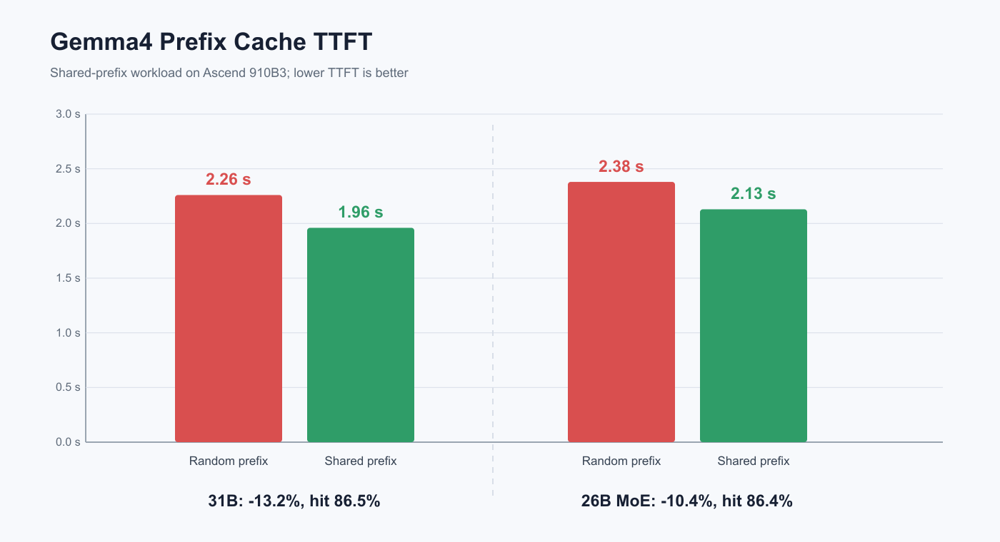

# 05 精度、性能基线与调优

[上一篇：量化适配](04_量化适配.md) | [返回总览](README.md)

## 1. 本篇做了什么

这一篇整理 Gemma4 适配中的精度定位、性能基线和调优方法：

| 工作 | 内容 | 目的 |
|---|---|---|
| 精度分类 | 区分数值漂移、状态错配、模型语义和通信问题 | 避免看到掉点就直接修改某个算子 |
| 分层验证 | 启动、Smoke、全量 GPQA-D、Token/Layer 对照 | 用不同成本的测试回答不同问题 |
| A5 MoE Graph 分析 | Eager/Graph、Dense/MoE、MC2/ALLGATHER 对照 | 收敛 Graph 精度问题范围 |
| FIA Mask 回归分析 | 建立提交时间线并恢复参数语义 | 找到 Nightly 精度和重复率回归原因 |
| 性能基线 | TTFT、TPOT、Throughput、Prefix Cache、W8A8 | 统一性能结论的比较口径 |
| MTP 评估 | Acceptance、Break-Even 和端到端成本 | 区分理论推进量与真实加速 |

重点不是得到一个最好看的分数，而是建立一套能解释结果、复现问题并判断修复是否完整的方法。

精度在这里不是一个只用于发布对比的分数。对于推理、问答、公共服务和行业应用，重复输出、无答案、选项偏移或静默掉点都会直接降低系统可信度。尤其是 Graph、MoE 和量化优化，它们可能在服务完全不报错的情况下改变 logits；如果只验证“能启动”和几条样例，问题会一直留到真实业务流量中。

因此我们同时关注准确率和生成健康度。GPQA-D 用来观察复杂推理结果，重复率、最大 Token 触顶率、No-Answer、输出长度和 Eager/Graph 差异则帮助判断底层执行是否稳定。分数用于发现结果变化，生成统计和逐层对照用于解释为什么变化。

## 2. 我们遇到了哪些精度问题

Gemma4 适配中遇到的“精度问题”至少包含四类：

| 类别 | 典型表现 | 常见根因 |
|---|---|---|
| 数值漂移 | 最终答案不同，但语言正常 | mask、scale、norm、kernel 精度 |
| 状态错配 | graph 乱码、重复，eager 正常 | layer metadata、cache、capture/replay |
| 模型语义错误 | 服务正常但持续掉点 | 激活函数、K=V、KV sharing |
| 调度/通信错误 | batch/padding 相关，MoE 特别明显 | active token、dispatch/combine、padding |

诊断时不能把“准确率下降”直接归因于某个算子。必须先找首个分叉阶段。

除了给出最终分数，本篇更关心怎样把输出异常定位到可验证的根因。生成模型的失败很少像单元测试那样直接指出哪一行错了：同一个底层状态错误，可能在某道题上表现为选项偏移，在另一道题上表现为韩文、特殊符号或无限重复。

因此我们把排查过程分成两条线：

- **正确性线**：服务能否启动，eager/graph 从哪个 token、哪个 layer 开始分叉；
- **统计线**：全量 accuracy、重复率、no-answer、输出长度和触顶率是否一起变化。

前者帮助定位机制，后者证明修复确实覆盖真实 workload。只有一条线通常都不够。

## 3. 我们如何分析：验证层级

### 3.1 启动验证

只证明：

- 权重可加载；
- profile/compile/capture 没有 crash；
- 服务端口 ready。

不能证明生成正确。

### 3.2 Smoke

4–10 题或少量固定 prompt 可快速判断方向，但方差很大。前 4 题从 2/4 变成 4/4，不足以证明全量精度恢复。

我们在适配过程中多次遇到“小样本看起来很好、全量仍只有 58%”的情况。前 4 题 3/4、前 10 题 9/10 都可能只是样本分布。Smoke 的正确用途是快速淘汰明显错误方案，不能替代完整评测。

### 3.3 全量任务

GPQA-D 198 题需要同时统计：

- accuracy；
- no-answer；
- output token 数；
- 达到 `max_tokens` 的比例；
- repetition；
- latency；
- 答案分布。

### 3.4 Token/Layer 对照

最终根因需要更细粒度：

- eager/graph 首个不同 token；
- 首个不同 layer；
- attention output；
- router logits/top-k；
- expert output；
- final logits。

理想的定位像剥洋葱：先固定同一个 prompt 和 greedy sampling，找到 eager/graph 第一个不同 token；再在产生该 token 的前向中找到第一个不同 layer；最后判断分叉发生在 attention、router、expert 还是 logits。越靠近首个分叉，证据越接近根因，越不容易被后续自回归放大效应误导。

## 4. 典型问题一：A5 MoE Graph 精度

### 4.1 现象

在相同 GPQA-D workload 中：

| 模式 | 典型分数 |
|---|---:|
| Eager | 约 73% |
| ACLGraph | 约 57% |

输出异常包括：

- reasoning 仍有逻辑但最终选项错误；
- 中文、韩文或特殊符号；
- 短语/整段重复；
- 长输出触及上限。

最初的迷惑点是，很多错误样本的 reasoning 看起来仍然有逻辑，甚至正文提到了正确选项，最后 `ANSWER` 却选了另一个字母。单看这些样本，很容易归因于答案抽取、channel 标签或采样偏置。但同一配置下 eager 明显更高、graph 稳定更低，说明必须先检查执行路径，而不是修改 prompt。

### 4.2 第一步：排除采样

将 eager 和 graph 都设为 greedy。若差异仍稳定存在，则：

- 温度不是主因；
- seed 不是主因；
- 问题位于确定性执行路径或状态。

Greedy 只用于定位。正式精度基线仍应使用官方推荐 sampling。

### 4.3 第二步：Dense/MoE 对照

31B Dense graph 达到约 77%–80%，而 26B MoE graph 显著下降，说明：

- multimodal/text decoder 基础框架并未普遍失效；
- 512-head attention 并非所有模型都必然错误；
- 需要检查 MoE 特有的 router、activation、EP 和通信。

这不等于 attention 无关。MoE 可放大 attention 的小幅漂移。

这组对照改变了排查方向。如果 Dense 和 MoE 同时失败，我们会继续优先检查公共 attention、RoPE 和 graph metadata；Dense 正常而 MoE 失败，则应在确认公共输出近似一致后，把观测点移到 router logits、Top-k 边界和 dispatch/combine。它没有直接给出答案，却把搜索空间从“整个模型”缩小到了“MoE 特有路径及其上游微小漂移”。

### 4.4 第三步：Padded Decode 隔离

临时让 padded decode step 不进入 graph，准确率回到约 70%。该实验说明问题与：

- graph replay；
- padded active token；
- 动态 batch；
- MoE dispatch/combine

相关。

但这不是可发布方案，因为它可能让关键 decode step 回到 eager，损失纯 graph 目标。

这个实验一度让分数恢复到约 70%，但我们没有把它当作最终修复。原因是“禁用 padded decode graph”同时改变了 graph 边界、active token、调度和 kernel 路径，变量太多。它只能说明问题位于这组机制附近，不能证明 padding 本身就是根因。更重要的是，用户需要纯 graph，不能用隐式 eager 回退换取表面正确。

### 4.5 第四步：Layer Identity 与 Workspace

修复 capture/replay layer identity 后，global layer 不再读取 sliding layer metadata；修复 max workspace 后，512-head FIA 不再因空间不足失败。

这两项是图执行正确性的必要条件，但 MoE 精度没有因此完全恢复，说明它们不是唯一根因。

### 4.6 第五步：通信 Backend A/B

A5 Gemma4 MoE graph 在运行期从 MC2/ALLTOALL 切换为 ALLGATHER：

| 路径 | 典型 GPQA-D |
|---|---:|
| MC2 graph | 约 57% |
| ALLGATHER graph | 约 73% |

ALLGATHER 仍然在 graph 模式中执行，因此该结果不是“整体 eager 恢复精度”。它把问题范围收敛到 MC2 graph 的 dispatch/combine 组合路径。

为什么这个实验比 padded-decode 回退更有说服力？因为它只改变 MoE token 通信/组合实现，attention、graph mode、模型权重和评测配置保持不变。变量越少，A/B 结果越接近因果证据。

### 4.7 当前结论边界

**已确认：**

- graph 框架可以得到正确输出；
- Dense graph 可正常工作；
- ALLGATHER 对照可恢复 MoE 精度；
- 问题与 A5 MoE graph 的 MC2 组合路径高度相关。

**尚未确认：**

- MC2 内部究竟是哪个 index/mask 字段；
- 是否仅由 padded token 触发；
- capture 和 replay 的哪一个动态值首次不一致；
- 是否能在保留 MC2 性能的同时局部修复。

我们刻意保留“尚未确认”部分。工程复盘最危险的写法，是把一个有效 workaround 写成已经定位的底层根因。现阶段可以可靠地说“问题高度集中在 MC2 graph 组合路径”，但在逐字段对照完成前，不应断言一定是某个 index 做了 `abs`、某个 mask 或某个 tokens-per-expert 值。

### 4.8 下一步算子级验证

对同一 batch、同一 decode step，同时记录：

```text
active_token_count
padded_token_count
topk_ids checksum
topk_weights checksum
expanded_row_idx min/max/checksum
tokens_per_expert
dispatch output checksum
combine input/output checksum
```

依次比较 eager、graph+MC2、graph+ALLGATHER，找到第一个不同字段。

## 5. 典型问题二：FIA Decode Mask 回归

### 5.1 时间序列

| 版本/实验 | 26B MoE GPQA-D | 说明 |
|---|---:|---|
| 回归前 nightly | 70.71% | head `95ef5af6474c` |
| #11266 后 | 46.97% | 大量 loop |
| 回退 routing replacement | 48.48% | 未恢复 |
| weight-layout 实验 | 约 60.1% | 有波动，loop 仍明显 |
| 恢复 FIA mask 行为 | 72.22% | loop 显著下降 |

### 5.2 #11266 改变了什么

在 FIA decode 的三处路径中同步改变：

1. 普通 eager/compiled 执行；
2. graph capture；
3. graph replay update。

关键参数组：

```text
atten_mask: existing causal/sliding mask -> None
sparse_mode: original 4/3 -> 0
```

### 5.3 为什么接口一致仍可能错误

#11266 在三个路径中都做了相同修改，因此“capture 和 replay 参数一致”。但一致不代表参数符合算子契约：

```text
wrong eager semantics
    ==
wrong capture semantics
    ==
wrong replay semantics
```

图不会自动发现模型语义错误，只会稳定重放。

### 5.4 全量验证

| 指标 | 行为变化存在 | 恢复旧行为 |
|---|---:|---:|
| Accuracy | 约 0.59–0.60 | **0.7222** |
| Loop 到 8192 tokens | 54/198（27.3%） | **5/198（2.5%）** |
| 平均输出 tokens | 2819 | **1273** |
| 中位输出 tokens | 未记录 | 914 |
| 平均延迟 | 65.6 s | **27.0 s** |


### 5.5 根因结论

PR [#12605](https://github.com/vllm-project/vllm-ascend/pull/12605) 对 [#11266](https://github.com/vllm-project/vllm-ascend/pull/11266) 做了功能上的完整回退：

- 仅修改 `attention_v1.py`；
- #11266 为 `+31/-8`；
- #12605 为 `+8/-31`；
- 恢复普通、capture、replay 的旧 mask/sparse-mode 行为；
- 没有夹带其他功能重构。

因此“#11266 整组行为变化是该回归的 PR 级根因”已被确认。

但 `atten_mask` 与 `sparse_mode` 同时恢复，现有 A/B 不能继续区分：

- 仅 mask 错误；
- 仅 sparse mode 错误；
- 两者组合错误。

若要给出算子字段级结论，需要三组额外实验：

```text
A: old mask + new sparse_mode
B: new mask + old sparse_mode
C: old mask + old sparse_mode
```

并比较首个分叉 token/layer。

### 5.6 为什么 Dense 更稳定

可能机制：

1. FIA 参数变化使 attention output 出现小偏差；
2. Dense MLP 是连续映射，误差逐层传播；
3. MoE router 在专家边界处发生 Top-8 翻转；
4. token 进入不同专家；
5. autoregressive decode 将差异放大。

这是合理机制，但不是“Dense 完全不受影响”的证明。Dense 仍需独立全量评测。

### 5.7 性能权衡

#11266 在 Qwen3 场景曾有小幅性能收益：

| 指标 | 变化 |
|---|---:|
| Output throughput | +0.46% |
| Mean TPOT | -0.44% |
| FIA kernel mean | -1.16% |
| AI Core | -2.05% |

恢复旧行为放弃了不足 1% 的部分端到端收益，以换取 Gemma4 MoE 的正确性和终止行为。框架的默认策略应优先正确。

## 6. 典型问题三：E2B/E4B Graph 精度

### 6.1 现象

E2B 曾出现：

- eager 输出正常；
- A5 graph 生成内容失真或与问题无关。

这说明基础权重加载和单算子语义大体可用，问题更可能在 graph state、KV sharing 或 PLE static buffer。

### 6.2 高优先级检查

1. KV-sharing target 是否跳过 `reshape_and_cache`；
2. C8/NZ path 是否同样跳过；
3. target 是否仍保留 producer cache 引用；
4. graph metadata owner 是否为正确 producer；
5. Q-only RoPE 是否被保持；
6. PLE 的 layer slice 是否在 padding 后错位；
7. self-decoder/cross-decoder compile boundary；
8. block table 和 slot mapping 是否对应同一 cache owner。

### 6.3 结论状态

KV-sharing cache 写入语义已适配，但 E2B/E4B graph 精度尚未形成与 31B/26B 同等级的全量数据闭环。因此文档只能写：

```text
基础结构与 KV-sharing 路径已接入；
graph 精度仍需专项验证和持续看护。
```

不能仅依据 PR 合入状态宣称精度已完成。

## 7. “Reasoning 正确但选项错误”如何分析

统计“错误答案中提到正确选项文本”的比例，只能说明模型可能在末端选择上敏感，不能直接证明“答案字母 logits 被 padding 污染”。

需要：

1. 使用 greedy；
2. 对齐 eager/graph token 序列；
3. 找首个不同 token；
4. 比较该 token 前的 logits top-k；
5. 比较最后一层 hidden state；
6. 比较 MoE router top-k；
7. 确认 parser 没有改变答案。

若 reasoning token 已提前分叉，则最终答案差异是长期轨迹结果，而不是单个答案字母 token 的局部偏置。

## 8. 推荐精度实验矩阵

| 维度 | 值 |
|---|---|
| 模式 | eager / FULL_DECODE_ONLY / PIECEWISE |
| 模型 | 31B / 26B-A4B / E2B / E4B |
| 采样 | greedy / 官方推荐 sampling |
| Batch | 1 / 8 / 目标生产 batch |
| Prompt | 短 / 中 / 长 / multimodal |
| Attention | FIA / PA / large-head fallback |
| MoE 通信 | MC2 / ALLGATHER |
| 数据规模 | 4 / 10 smoke / 198 full |

一次实验只改变一个主变量。

## 9. 精度数据来源

| 数据 | 来源 |
|---|---|
| 回归前 70.71% | [Nightly run 29756579967](https://github.com/vllm-project/vllm-ascend/actions/runs/29756579967) |
| 回归后 46.97% | [Nightly run 29845430434](https://github.com/vllm-project/vllm-ascend/actions/runs/29845430434) |
| Routing 对照 48.48% | [Nightly run 29891988049](https://github.com/vllm-project/vllm-ascend/actions/runs/29891988049) |
| 恢复后 72.22% / loop 2.5% | PR #12605 全量验证报告 |
| 恢复版本 nightly | [29904817021](https://github.com/vllm-project/vllm-ascend/actions/runs/29904817021)、[29905076585](https://github.com/vllm-project/vllm-ascend/actions/runs/29905076585) |

部分早期 workflow 总状态为 failure，因为同一 workflow 还有其他 case。引用 Gemma4 数据时应保留 job/case 级证据。

完整的功能和执行模式验证还可以从以下入口交叉核对：

- [Gemma4 特性与性能产物总览](https://github.com/0moyi0-2024/vllm-ascend_tp/blob/gemma4_performence_glm52/gemma4_perf_artifacts/README.md)
- [Eager、PIECEWISE、FULL_DECODE_ONLY 综合特性报告](https://github.com/0moyi0-2024/vllm-ascend_tp/blob/gemma4_performence_glm52/gemma4_perf_artifacts/feature_graphmode_fdo_20260723/reports/gemma4_feature_graphmode_consolidated.md)
- [vLLM Ascend Gemma4 官方部署与评测教程](https://docs.vllm.ai/projects/ascend/en/latest/tutorials/models/Gemma4.html)

## 10. 精度修复的完成标准

```text
1. 服务可启动
2. greedy eager/graph 基本一致
3. 全量任务恢复
4. repetition/max-token 触顶恢复
5. Dense/MoE 分别验证
6. 性能没有不可接受回退
7. PR smoke 和 nightly 均有覆盖
8. 结论能区分已确认、实验定位和推断
```

## 11. 性能分析：指标与测试口径

精度正确以后，性能优化才有意义。我们把性能看成一笔分阶段账单：

```text
请求排队
  + multimodal encoder
  + prefill
  + 首 token
  + 持续 decode
  + 通信与同步
```

不同特性优化的是不同部分。Prefix Cache 主要减少重复 prefill，ACLGraph 主要减少 decode 的 host launch，W8A8 主要降低矩阵计算和带宽成本，MTP 则尝试减少 target 串行 step 数。只报告一个“总耗时”很难解释收益来自哪里。

### 11.1 TTFT

$$
\mathrm{TTFT}=t_{\mathrm{first\ token}}-t_{\mathrm{request}}
$$

TTFT 包含排队、multimodal encoder、prefill、调度、通信和首个 decode。

### 11.2 TPOT

$$
\mathrm{TPOT}
=\frac{t_{\mathrm{last}}-t_{\mathrm{first}}}
{N_{\mathrm{output}}-1}
$$

TPOT 主要衡量持续 decode。单用户 decode rate 近似：

$$
\mathrm{DecodeRate}\approx\frac{1000}{\mathrm{TPOT(ms)}}
$$

### 11.3 Throughput

必须区分：

- request throughput；
- total token throughput；
- output token throughput；
- per-user decode rate。

并发增加时，总吞吐可以上升，而单请求 TPOT 变差。

## 12. 性能数据环境

性能报告位于：

```text
repository: https://github.com/0moyi0-2024/vllm-ascend_tp
branch: gemma4_performence_glm52
index: gemma4_perf_artifacts/README.md
```

`performence` 是历史分支名称，引用时保持原拼写。

### 12.1 特性验证环境

| 项 | 值 |
|---|---|
| Device | 8 × Ascend 910B3，64 GiB/card |
| vLLM | 0.23.0 |
| vLLM Ascend | `f298192fe` |
| torch / torch-npu | 2.10.0 / 2.10.0 |
| Parallel | TP2；26B 额外 EP |
| Mode | Eager |
| Workload | 每 case 12 个功能请求 |

该实验主要验证特性可用性，除 Prefix Cache 专项外，不作为严格性能 A/B。

### 12.2 W8A8 性能环境

| 项 | 值 |
|---|---|
| Device | Ascend 910B3 |
| vLLM | 0.23.0，v1 engine |
| vLLM Ascend | `a83b055e` |
| Parallel | TP1 |
| Graph | 显式 PIECEWISE |
| Memory utilization | 0.92 |
| Max model length | 6144 |
| Prefix Cache | 关闭 |

## 13. 当前结果：W8A8 性能基线

### 13.1 31B Dense

| Workload | Input → Output | TPOT | TTFT | Decode rate | Success |
|---|---:|---:|---:|---:|---:|
| Text random | 4096 → 1536 | **37.1 ms** | 1000 ms | 26.93 tok/s | 100% |
| Image random_vl, 1920×1080 | 297 → 256 | **36.0 ms** | 458 ms | 27.77 tok/s | 100% |

PIECEWISE capture 35/35，约 18 秒。

### 13.2 26B MoE Only-Experts

| Workload | Input → Output | TPOT | TTFT | Decode rate | Success |
|---|---:|---:|---:|---:|---:|
| Text random | 4096 → 1536 | **22.2 ms** | 422 ms | 44.94 tok/s | 100% |
| Image random_vl, 1920×1080 | 297 → 256 | **22.9 ms** | 458 ms | 43.76 tok/s | 100% |

PIECEWISE capture 35/35，约 17 秒，KV cache 20.22 GiB。


### 13.3 结果解释

MoE 在这组数据中更快，主要因为：

- 26B 为 30 层，31B 为 60 层；
- 每 token 激活 8/128 experts；
- experts 使用 W8A8_DYNAMIC；
- 测试是 TP1，无多卡 EP 通信。

不能外推为“MoE 在多卡高并发下总比 Dense 快”。多卡 MoE 还受 dispatch/combine、expert imbalance 和通信影响。

这组结果讲的是特定 workload 下的现象，不是模型架构排名。26B 层数更少、每 token 只激活部分专家，并且 TP1 没有跨卡 EP 通信，所以 TPOT 更低是合理的；换成 TP4+EP、高 batch 或专家负载不均时，通信可能重新成为主导成本。

### 13.4 为什么使用 PIECEWISE

报告对应构建中：

- FULL_DECODE_ONLY 的 512-head PA capture 报 ACL 107033；
- 强制 FIA 512 报 561002；
- Eager TPOT 约 154 ms；
- PIECEWISE 按 attention/compile 边界捕获，可完成 35 个子图。

后续主干已继续修复 mixed PA/FIA。上述结论是该版本的基线条件，不表示当前主干永久不能使用 FULL_DECODE_ONLY。

## 14. 当前结果：Prefix Cache 与运行时特性收益

### 14.1 Prefix Cache

| 模型 | Hit rate | Random TTFT | Shared TTFT | 改善 |
|---|---:|---:|---:|---:|
| 31B | 86.5% | 2.26 s | 1.96 s | 13.2% |
| 26B MoE | 86.4% | 2.38 s | 2.13 s | 10.4% |



命中率不等于端到端时间改善比例，因为 TTFT 还包含非共享尾部、调度、通信和首 decode。

### 14.2 Feature Smoke 的轻量观测

| Case | 31B mean | 26B mean |
|---|---:|---:|
| Baseline | 2.737 s | 3.116 s |
| Chunked Prefill | 2.950 s | 3.159 s |
| Prefix case | 2.955 s | 3.105 s |
| Weight NZ | 2.636 s | 3.033 s |
| Async | 2.965 s | 3.207 s |
| CPU Binding | 2.696 s | 2.875 s |
| Chunked + Prefix | 3.157 s | 3.275 s |

该表主要证明 14 个 case 全部可运行。请求数少、无并发压力、slot 不同，不能据此排序特性收益。

## 15. Graph 与通信调优

### 15.1 FULL_DECODE_ONLY

早期四 prompt 诊断样例：

| 模式 | 输出速度 |
|---|---:|
| Eager | 约 30.19–31.37 tok/s |
| FULL_DECODE_ONLY | 约 73.61–74.04 tok/s |

它展示 graph decode 的潜力，但缺少完整环境和重复次数，不是正式 benchmark。

### 15.2 Workspace

Capture 期缓存 bucket 最大 workspace：

$$
W_b=\max_{l\in L_b}W(l,b)
$$

Replay 复用 $W_b$，避免运行期 workspace 查询和反复分配。

### 15.3 A2/A3 Mixed Backend

31B 和 26B 的 global layer 都约占 16.7%。A2/A3 只让这些 512-head decode layer 走 PA，其余约 83.3% sliding layer 继续 FIA，比全 PA 更能保留性能。

### 15.4 MoE 通信

| Backend | 优势 | 代价 |
|---|---|---|
| MC2 / fused dispatch-combine | 通信融合潜力高 | Graph 动态 token/index 正确性要求高 |
| ALLGATHER | 语义简单，适合精度基线 | 通信量和显存压力较高 |

Batch 16 可能比 batch 8 更慢，原因包括：

- all-gather 数据量；
- graph bucket 放大；
- expert imbalance；
- batch 长尾；
- active token 比例；
- KV/workspace 压力。

## 16. MTP 的性能收益

MTP 是这套适配中最容易被“接受率数字”误导的特性。它的直觉很有吸引力：一个轻量 draft 先猜多个 token，昂贵 target 一次验证，似乎 target 调用次数立刻下降。但系统真正支付的成本还包括 draft、并行验证、KV 同步、sampling 和 graph 参数更新。因此我们既记录 acceptance，也坚持做端到端 on/off 对照。

### 16.1 基本机制

MTP/speculative decoding 由 draft 一次提出 $k$ 个 token，target 并行验证：

```text
draft:  t1, t2, t3
target: verify [t1, t2, t3] in one pass
commit: accepted prefix + one rejection/bonus token
```

若第 $i$ 个位置的边际接受概率为 $p_i$，平均接受的 draft token 数为：

$$
\mathbb{E}[A]=\sum_{i=1}^{k}p_i
$$

### 16.2 Gemma4 阶段性数据

A5、`k=3`：

| Position | Marginal acceptance |
|---|---:|
| 0 | 74.0% |
| 1 | 49.2% |
| 2 | 26.4% |

因此：

$$
\mathbb{E}[A]=0.740+0.492+0.264=1.496\approx1.50
$$

504 次 draft 共接受 754 个 token，与该计算一致。

### 16.3 Target Step 的理论减少

标准 speculative decoder 每次 target verification 通常提交：

$$
\mathbb{E}[\mathrm{Progress}]\approx\mathbb{E}[A]+1\approx2.50
$$

额外的 1 来自第一个拒绝位置的 target token，或全部接受后的 bonus token；具体实现和 EOS 边界需按 vLLM 版本确认。

若忽略所有额外开销，target 串行 decode step 数理论上可降低为：

$$
\frac{1}{2.50}=0.40
$$

即 target 启动次数上限意义上最多减少约 60%。这不是端到端 2.5 倍加速承诺。

### 16.4 Break-Even 条件

设：

- $T_b$：target 单 token baseline decode；
- $T_d(k)$：draft 生成 $k$ token；
- $T_v(k)$：target 并行验证；
- $T_s$：KV 同步、sampling、graph update；
- $P=\mathbb{E}[A]+1$：每轮平均推进 token。

MTP 有收益的条件：

$$
T_d(k)+T_v(k)+T_s < P\cdot T_b
$$

端到端 speedup 近似：

$$
\mathrm{Speedup}
\approx
\frac{P\cdot T_b}
{T_d(k)+T_v(k)+T_s}
$$

接受率只决定 $P$，不能反映分母。

### 16.5 为什么实际收益低于理论上限

- Draft 自身需要计算；
- Target verification 一次处理多个 query token，成本高于单 token decode；
- Target/draft KV cache 需要同步；
- Graph 需要额外 capture size 和 input update；
- Rejection 会浪费后续 draft 计算；
- Batch 内不同请求的接受长度产生动态性；
- MoE target 还包含 router 和专家通信；
- 小 batch 时 host/launch 开销占比不同；
- 长 context 时 attention 读 KV 成本增加。

### 16.6 为什么 Gemma4 可能受益

Gemma4 target 计算较重：

- 31B 有 60 层；
- 26B MoE 每 token 激活 Top-8 experts；
- Multimodal prefill 后 decode 较长；
- ACLGraph 可减少 target verification launch 开销。

当 draft 足够轻、acceptance 保持 1.5/step 左右时，target 调用次数下降可能带来明显收益。

尤其对 26B MoE，少一次 target step 不只是少做一次 attention，还可能少做一轮 router、Top-8 expert 计算和跨卡 dispatch/combine。这让 MTP 的潜在价值高于轻量 Dense 模型；同样也意味着 target verification 处理多个 token 时，MoE 动态 shape 和通信成本更复杂，理论收益更难完全兑现。

### 16.7 为什么 Gemma4 MTP 也更难

- 256/512 交错 attention；
- draft/target layer identity；
- E2/E4 Q-only RoPE 和 KV sharing；
- PA/FIA graph param；
- MoE active token 和通信；
- PLE static buffer；
- mask/sparse mode。

Target 接受 token 后，draft KV 必须推进到同一位置。任何漏同步都可能使第一轮正常、后续重复。

### 16.8 MTP 当前状态

相关实现包含 proposer、Q-only RoPE、target/draft KV 同步和 speculative config。Acceptance 曲线随位置递减，形态合理。

但当前数据只证明候选质量，尚未提供：

- MTP on/off 的同 workload TPOT；
- output throughput；
- TTFT；
- HBM；
- GPQA-D；
- A2/A3/A5 矩阵；
- 不同 $k$ 的 sweep。

因此不能仅用 1.50 accepted/step 宣称具体端到端加速倍数。

### 16.9 MTP 性能评测设计

固定：

- model/weights；
- prompt/output length；
- batch/concurrency；
- graph mode；
- sampling；
- TP/EP；
- warm-up。

对比：

| Case | k | 需要采集 |
|---|---:|---|
| Baseline | 0 | TTFT、TPOT、throughput、HBM |
| MTP | 1 | 同上 + acceptance |
| MTP | 2 | 同上 + acceptance by position |
| MTP | 3 | 同上 + draft/verify/sync time |
| MTP | 4+ | 判断边际 acceptance 是否抵消额外成本 |

记录分解时间：

```text
draft_time
target_verify_time
kv_sync_time
graph_update_time
accepted_tokens
committed_tokens
rejected_tokens
```

### 16.10 MTP 与量化组合

建议顺序：

```text
BF16 baseline
 -> BF16 MTP
 -> W8A8 target
 -> W8A8 target + BF16 draft
 -> quantified draft + target
```

量化误差可能降低 acceptance；若仅看 target kernel 变快而忽略 acceptance 下降，端到端收益可能反而变差。

## 17. 推荐调优顺序

1. BF16 eager greedy 正确；
2. BF16 graph greedy 正确；
3. 全量 GPQA-D；
4. graph mode；
5. max model length / cache；
6. TP/EP；
7. batch/concurrency sweep；
8. Prefix Cache / Chunked Prefill；
9. Async / CPU Binding / NZ；
10. MoE 通信；
11. W8A8；
12. MTP；
13. 量化 MTP；
14. 组合特性。

## 18. 建议的持续性能基线

| 维度 | 建议 |
|---|---|
| Device | A2、A3、A5 分开 |
| Model | 31B、26B；BF16/W8A8 |
| Parallel | TP1/2/4；MoE EP |
| Graph | eager、FULL_DECODE_ONLY、PIECEWISE |
| Workload | 128/128、4096/1536、图片/256 |
| Concurrency | 1、4、8、16 |
| MTP | k=0/1/2/3/4 |
| Metrics | TTFT p50/p90/p99、TPOT、throughput、HBM、acceptance |
| Accuracy gate | Greedy smoke + GPQA-D |

## 19. 性能证据与报告

现有性能结果来源于固定环境下保存的服务日志、客户端结果和汇总报告。对外引用性能数据时必须同时给出设备、版本、模型、权重、TP/EP、Graph Mode、输入输出长度和并发。

| 报告 | 可回答的问题 |
|---|---|
| [性能产物总览](https://github.com/0moyi0-2024/vllm-ascend_tp/blob/gemma4_performence_glm52/gemma4_perf_artifacts/README.md) | 当前保存了哪些特性、图模式和量化性能证据 |
| [Graph 模式综合报告](https://github.com/0moyi0-2024/vllm-ascend_tp/blob/gemma4_performence_glm52/gemma4_perf_artifacts/feature_graphmode_fdo_20260723/reports/gemma4_feature_graphmode_consolidated.md) | Eager、PIECEWISE、FULL_DECODE_ONLY 在固定特性矩阵下是否可运行，轻量延迟如何变化 |
| [FULL_DECODE_ONLY 报告](https://github.com/0moyi0-2024/vllm-ascend_tp/blob/gemma4_performence_glm52/gemma4_perf_artifacts/feature_graphmode_fdo_20260723/reports/feature_graphmode_fdo_report.md) | TP4 下完整 Decode Graph 的 Capture 和请求结果 |
| [PIECEWISE 报告](https://github.com/0moyi0-2024/vllm-ascend_tp/blob/gemma4_performence_glm52/gemma4_perf_artifacts/feature_graphmode_piecewise_20260723/reports/feature_graphmode_piecewise_report.md) | TP2 Piecewise Graph 的特性组合与轻量性能 |
| [31B Dense W8A8 基线](https://github.com/0moyi0-2024/vllm-ascend_tp/blob/gemma4_performence_glm52/gemma4_perf_artifacts/dense_w8a8_baseline_20260713/reports/quant_tp1_piecewise_baseline.md) | Dense 量化文本/图片的 TTFT、TPOT 和吞吐 |
| [26B MoE W8A8 基线](https://github.com/0moyi0-2024/vllm-ascend_tp/blob/gemma4_performence_glm52/gemma4_perf_artifacts/moe_w8a8_baseline_20260713/reports/quant_moe_tp1_piecewise_baseline.md) | MoE Only-Experts 量化文本/图片的 TTFT、TPOT 和吞吐 |
| [FDO 历史根因报告](https://github.com/0moyi0-2024/vllm-ascend_tp/blob/gemma4_performence_glm52/gemma4_perf_artifacts/feature_verify_20260711/reports/fdo_cudagraph_capture_rootcause.md) | 早期 FDO Capture 失败是如何定位的 |

综合报告中的 42/42 通过表示该版本、该设备和该测试矩阵下，5 类运行时特性在两种模型与三种执行配置中均完成启动、Capture 和请求验证。它是功能与轻量性能证据，不等价于高并发压测，也不能替代全量精度。

## 20. 当前结果与边界

### 已经确认

- 31B Dense 可以作为公共 Attention/Graph 的有效控制组；
- A5 MoE Graph 的精度问题高度集中在 MC2 Dispatch/Combine 组合路径；
- ALLGATHER 控制组在保持 Graph 的情况下恢复到约 73%；
- FIA Decode Mask 回归会同时影响 Accuracy、Loop Rate 和输出触顶；
- 恢复 Mask/Sparse-Mode 语义后 A2 MoE GPQA-D 回到 72.22%；
- W8A8 TP1 PIECEWISE 已有文本和图片性能基线；
- MTP `k=3` 的平均 Accepted Draft Token 约为 1.50。

### 仍需继续验证

- MC2 内部第一个发生差异的动态字段；
- E2B/E4B Graph 的完整精度闭环；
- A5、A2/A3 的统一 MTP On/Off 性能矩阵；
- W8A8 与 MTP 组合后的 Acceptance 和精度；
- 多卡 EP、高并发和长上下文下的性能稳定性。

后续报告需要继续区分三类结论：

```text
已确认：有直接 A/B、代码或运行时证据
已定位范围：已收敛到子系统，但未确认具体字段
待验证假设：机制合理，仍缺实验
```
