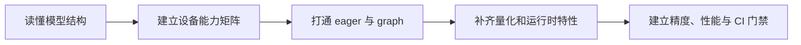
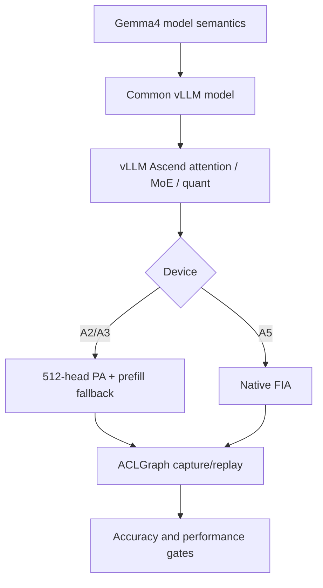
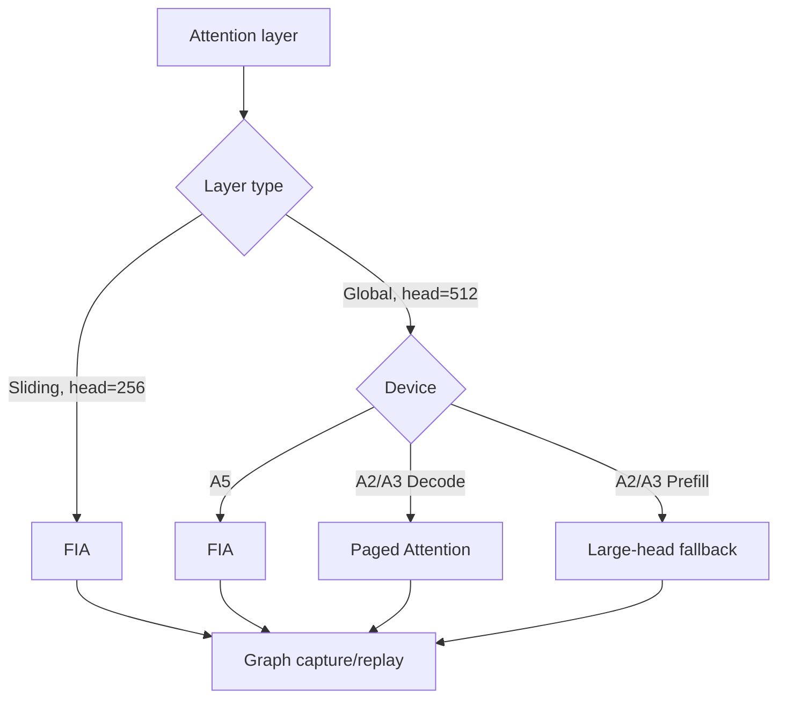

# Gemma4 on Ascend 适配 Wiki

> 设备：Atlas A2、Atlas A3、Ascend 950（A5）
> 模型：Gemma4 31B Dense、26B-A4B MoE、E2B、E4B
> 内容：模型结构、设备适配、运行时特性、量化、精度、性能、MTP 与调优

这不是一份“把几个 PR 罗列在一起”的变更记录，而是一次完整模型适配的复盘。我们希望回答的不只是“改了哪些文件”，还包括：

- 为什么同一个模型在 A2/A3 和 A5 上要选择不同的 attention 路径；
- 为什么服务能够启动、短问题能够回答，仍然不能说明适配完成；
- 为什么 Dense 模型正常而 MoE 模型可能在图模式下出现重复输出；
- 为什么一个看似无害的 mask、workspace 或 graph metadata 变化会带来十几个点的精度波动；
- 我们如何把一次次故障转化为设备抽象、单测、E2E 和 Nightly 看护。

读完后，读者应当能够沿用同样的方法适配下一个模型，而不只是复现 Gemma4 的现有结论。

## 1. 从“能启动”到“能上库”

项目刚开始时，目标看起来很直接：让 Gemma4 在 Ascend 上完成权重加载和文本生成。真正开始后，我们很快发现它同时叠加了几类后端最敏感的结构：

1. Sliding attention 与 global attention 交错出现，而且 head dimension 分别是 256 和 512。
2. 31B 是 Dense，26B-A4B 是 128 专家、Top-8 的 MoE，两者共享 attention 骨架，却有完全不同的 FFN 和通信路径。
3. Global layer 使用 K=V，不能假设 checkpoint 总有独立的 `v_proj`。
4. E2B/E4B 又加入 PLE、YOCO 和跨层 KV sharing，执行当前层时使用的 KV 可能属于更早的 producer layer。
5. A2/A3 与 A5 的算子能力不同：A5 的 FIA 可以处理 512 head，A2/A3 需要在 global layer 上做窄范围 fallback。
6. ACLGraph 把 Python 动态执行变成 capture/update/replay，任何 layer identity、workspace、mask 或 cache owner 的错配都会被稳定重放。

因此，我们把“适配完成”拆成了五个阶段，而不是直接改 attention：



每一阶段都回答一个不同的问题：

| 阶段 | 核心问题 | 通过标准 |
|---|---|---|
| 模型语义 | 模型数学上到底做了什么 | Layer、shape、mask、activation、cache owner 可明确描述 |
| 设备适配 | 当前 SOC 能否原生执行这些 shape | 每个阶段和 shape 都有明确 backend |
| 图执行 | Capture 和 replay 是否仍执行同一语义 | 参数类型、metadata、workspace、mask 全部一致 |
| 量化/特性 | 优化路径是否保持原模型语义 | 不只拉起，还要做精度与组合验证 |
| 长期看护 | 后续主干变化是否会破坏支持 | PR smoke、Nightly 精度和性能基线齐全 |

## 2. 这次适配经历了哪些关键转折

整个过程并不是一次设计完成后顺利落地，而是由几次很有代表性的故障推动的：

### 2.1 A5：同一个 FIA 算子为什么突然说 workspace 不够

A5 图模式启动时，global layer 报出：

```text
passed workspace:   55,664,128 bytes
required workspace: 104,871,936 bytes
```

最初看起来像内存不足，实际是交错层共用了同一个 token bucket：先 capture 的 256-head sliding layer 缓存了较小 workspace，后面的 512-head global layer 需要更大的空间。最终方案不是每次 replay 动态查询，而是在 capture 阶段记录同 bucket 的最大需求并复用。

### 2.2 A2/A3：修完 512 head 后，为什么 graph 参数又解包失败

A2/A3 的 FIA TND 不支持 512 head。我们让 global decode 走 PA、sliding decode 保留 FIA，于是同一张图第一次同时出现两种 attention backend。Capture 时 PA 保存 9 项参数，FIA 保存另一种参数结构；旧 update 逻辑仍按全局条件猜测类型，最终出现：

```text
ValueError: not enough values to unpack (expected 21, got 9)
```

这次故障促使我们放弃 `len(param)` 这样的魔术数字，改用显式 graph param 类型表达“这是谁的参数”。

### 2.3 图模式能跑以后，为什么 MoE 精度仍从约 73% 掉到约 57%

Dense 31B 图模式表现正常，而 26B MoE 出现答非所问、重复和 max-token 触顶。这个对照非常关键：它说明公共 attention 主干大概率不是唯一问题。我们随后依次对比 padded decode、layer metadata、workspace 和 MoE 通信路径。将 MC2/ALLTOALL 改为 ALLGATHER 后，精度回到约 73%，把问题范围收敛到图模式下的 token dispatch/combine 动态语义，而不是“图模式整体退回 eager”。

### 2.4 一次 mask 改动为什么能让 Nightly 精度大幅下降

后续主干变更同时修改了 FIA eager、capture 和 replay 的 mask/sparse-mode 参数。接口数量对得上、服务也能启动，但 Gemma4 MoE 的 GPQA-D 从约 70% 降到约 47%，重复率和输出触顶明显上升。完整恢复旧语义后精度回到约 72%。这件事再次说明：图模式正确性不是“参数能传进去”，而是每个参数值都必须符合算子和模型契约。

## 3. 如何阅读这套文档

本 Wiki 保留一个总览和五篇主体文档。第一次阅读建议按顺序进行；已经遇到具体问题的读者，可以直接从右侧场景进入：

| 文档 | 内容 |
|---|---|
| [01 模型结构分析](01_模型结构分析.md) | Multimodal、交错注意力、K=V、Dense/MoE、PLE、YOCO、KV sharing |
| [02 A2/A3/A5 适配过程](02_A2_A3_A5适配过程.md) | 分设备 attention 路径、ACLGraph、workspace、PA/FIA、RoPE、关键问题和代码演进 |
| [03 特性接入情况](03_特性接入情况.md) | Tool/reasoning parser、Chunked Prefill、Prefix Cache、NZ、Async、CPU Binding、Graph、EP、CI |
| [04 量化适配](04_量化适配.md) | ModelSlim、K=V 权重、专家路径、GELU-TANH、C8 cache、W8A8 验证 |
| [05 精度、性能基线与调优](05_精度性能基线与调优.md) | A5 MoE graph、FIA mask 回归、GPQA-D、W8A8 性能、MTP 收益、性能调优 |

原始报告、复现命令和 PR 链接不再单独成篇，统一放在相关主体文档的“证据与来源”章节。

如果只想解决一个具体问题：

| 你正在处理的问题 | 建议先读 |
|---|---|
| 不理解为什么 global/sliding 不能共用配置 | 01 的交错注意力与 K=V |
| A2/A3 512-head 启动失败 | 02 的 large-head fallback |
| Graph 报 9/21 参数解包错误 | 02 的 Mixed PA/FIA graph |
| A5 FIA workspace mismatch | 02 的 A5 FIA workspace |
| MoE 图模式重复、乱码、掉点 | 05 的 A5 MoE graph 精度问题 |
| W8A8 缺 `v_proj` 或激活不匹配 | 04 的 K=V 与 GELU-TANH |
| 想评估 MTP 是否真的加速 | 05 的 MTP 收益与 break-even |

## 4. 核心结论

Gemma4 适配不是增加一个模型名称，而是同时处理：

1. Sliding/global attention 交错，head dimension 分别为 256/512。
2. 31B Dense 与 26B Top-8/128-expert MoE 的结构差异。
3. Global layer 的 `attention_k_eq_v`。
4. E2B/E4B 的 PLE、YOCO 和跨层 KV sharing。
5. A2/A3 不支持 FIA TND 512 head，而 A5 支持。
6. 同一个 A2/A3 decode graph 混合 PA/FIA。
7. Capture/replay 的 layer metadata、workspace、mask 和动态 MoE token 必须一致。
8. 量化路径不能默认独立 V projection 或 SwiGLU。



## 5. 支持状态

| 能力 | 31B Dense | 26B-A4B MoE | E2B | E4B |
|---|---|---|---|---|
| A2/A3 eager | 已支持 | 已支持 | 基础路径已支持 | 基础路径已支持 |
| A2/A3 ACLGraph | 已支持 | 已支持 | KV-sharing 已接入，精度待专项看护 | KV-sharing 已接入，精度待专项看护 |
| A5 eager | 已支持 | 已支持 | 基础路径已支持 | 基础路径已支持 |
| A5 ACLGraph | 已支持 | 已支持；MC2 graph 组合路径仍建议专项验证 | Graph 精度待闭环 | Graph 精度待闭环 |
| ModelSlim W8A8 | 已适配 | 已适配 | 待 checkpoint 级验证 | 待 checkpoint 级验证 |
| MTP | 进行中 | 进行中 | 待专项验证 | 待专项验证 |
| Nightly GPQA-D | 已覆盖 | 已覆盖 | 尚未建立同等级基线 | 尚未建立同等级基线 |

## 6. 分设备执行路径



## 7. 关键精度结果

| 场景 | 回归 | 修复/对照 | 结论 |
|---|---:|---:|---|
| A5 26B MoE graph | 约 73% eager → 57% graph | Graph + ALLGATHER 约 73% | 问题收敛到 A5 MoE graph 的 MC2 组合路径 |
| A2 FIA decode mask | 70.71% → 46.97% | 恢复后 72.22% | #11266 的整组行为变化是 PR 级根因 |
| A2 loop rate | 27.3% | 2.5% | 重复和 max-token 触顶显著恢复 |


## 8. 关键性能结果

性能数据来自 `gemma4_performence_glm52` 分支，设备为 Ascend 910B3，vLLM 0.23.0，TP1，显式 PIECEWISE：

| 模型/权重 | 文本 TPOT | 图片 TPOT | Decode rate |
|---|---:|---:|---:|
| 31B Dense W8A8 | 37.1 ms | 36.0 ms | 26.93–27.77 tok/s |
| 26B MoE only-experts W8A8 | 22.2 ms | 22.9 ms | 43.76–44.94 tok/s |


Prefix Cache 专项 workload：

| 模型 | Hit rate | Random TTFT | Shared TTFT | 改善 |
|---|---:|---:|---:|---:|
| 31B | 86.5% | 2.26 s | 1.96 s | 13.2% |
| 26B MoE | 86.4% | 2.38 s | 2.13 s | 10.4% |

## 9. MTP 收益摘要

A5、`k=3` 的阶段性结果：

| Draft position | Acceptance |
|---|---:|
| 0 | 74.0% |
| 1 | 49.2% |
| 2 | 26.4% |

504 次 draft 共接受 754 个 token，平均：

$$
\mathrm{AcceptedPerStep}=754/504\approx1.50
$$

这说明一次 target verification 平均可推进约 1.5 个 draft token，但实际加速还取决于 draft 成本、target verification 成本、KV 同步、graph replay 和 batch。详见 [05 精度、性能基线与调优](05_精度性能基线与调优.md)。

## 10. 我们最终沉淀了什么

这次适配最后留下的不只是几个设备分支，而是一套可以复用的工程方法：

1. **先定义模型不变量，再选择算子。** 后端优化不能改变 K=V、activation、mask 和 cache owner。
2. **设备差异靠近 DeviceAdaptor。** 通用 attention 主流程只描述语义，不堆叠 A2/A3/A5 判断。
3. **Graph 参数显式表达身份。** Capture backend、replay backend 和参数类型必须相同。
4. **动态状态必须找到真正的 owner。** 当前执行 layer 不一定拥有当前使用的 metadata 或 KV cache。
5. **Workspace 按完整 shape 集合规划。** 交错层不能只看第一个 capture 的算子需求。
6. **Fallback 用来隔离问题，不用来掩盖问题。** 正式方案要说明哪些 shape fallback、为什么以及性能代价。
7. **精度和性能都必须有控制组。** Dense/MoE、eager/graph、MC2/ALLGATHER 的对照比单次分数更有信息量。
8. **CI 要看护真实风险。** 启动 smoke 防 crash，Nightly 防精度回归，性能基线防优化退化。

如果把这些原则压缩成一句话，就是：**模型适配不是让某条命令成功，而是让模型语义在不同设备、不同执行模式和不同优化组合下仍然成立。**
