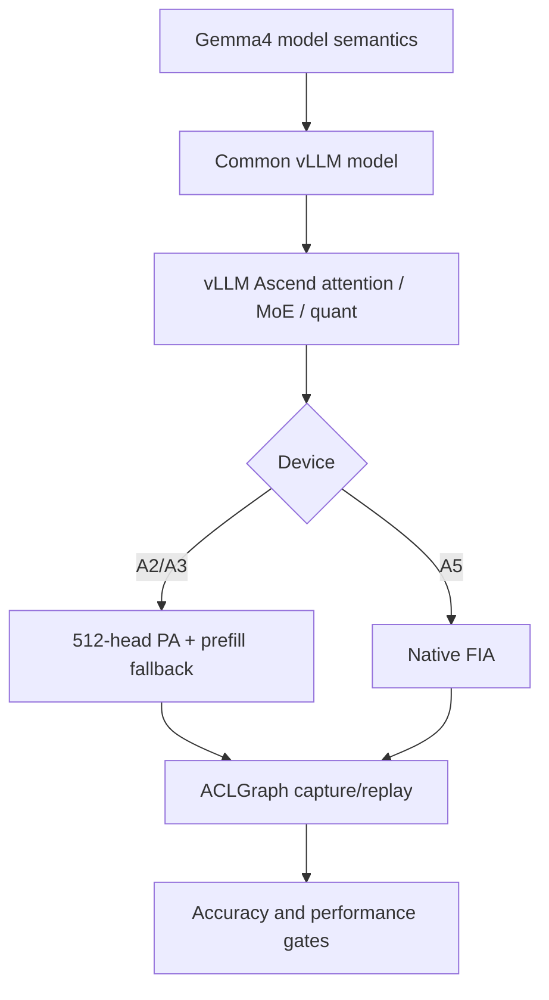
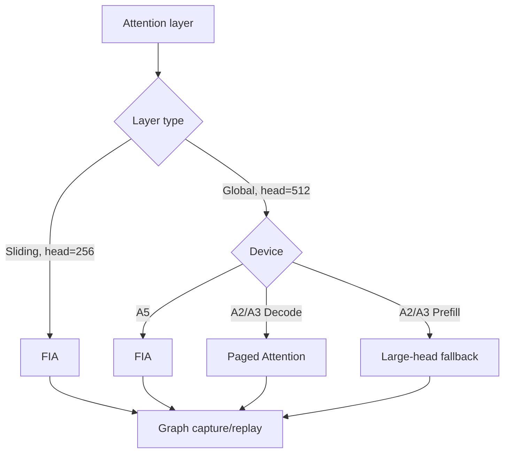
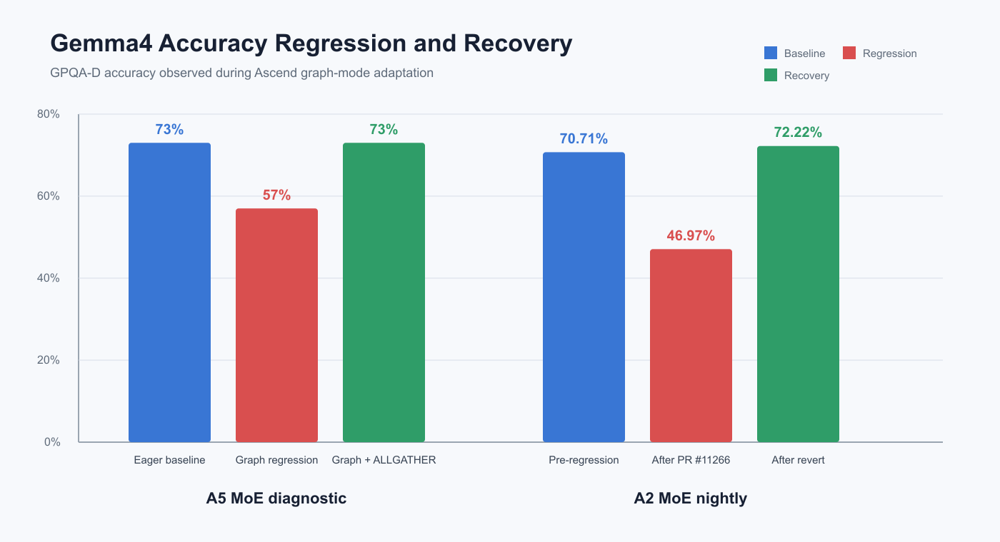
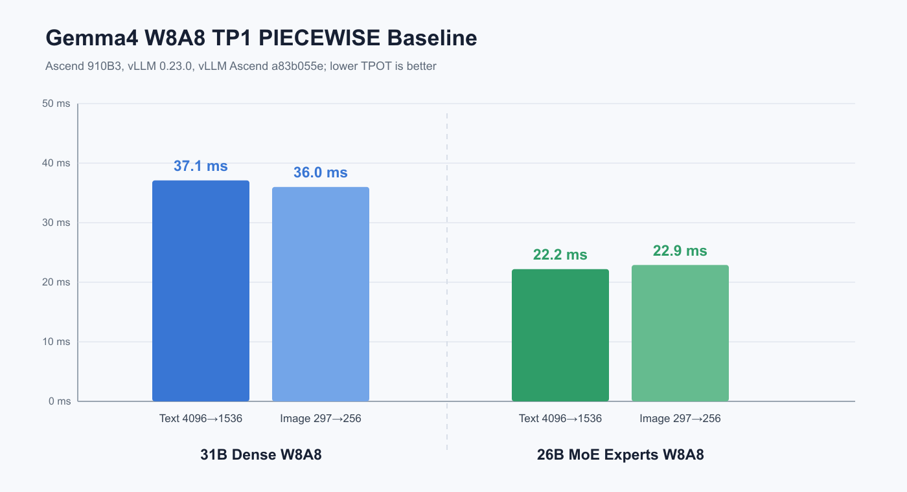

# Gemma4 on Ascend 适配 Wiki

> 设备：Atlas A2、Atlas A3、Ascend 950（A5）
> 模型：Gemma4 31B Dense、26B-A4B MoE、E2B、E4B
> 内容：模型结构、设备适配、运行时特性、量化、精度、性能、MTP 与调优

## 1. 文档结构

本 Wiki 只保留一个总览和五篇主体文档：

| 文档 | 内容 |
|---|---|
| [01 模型结构分析](01_模型结构分析.md) | Multimodal、交错注意力、K=V、Dense/MoE、PLE、YOCO、KV sharing |
| [02 A2/A3/A5 适配过程](02_A2_A3_A5适配过程.md) | 分设备 attention 路径、ACLGraph、workspace、PA/FIA、RoPE、关键问题和代码演进 |
| [03 特性接入情况](03_特性接入情况.md) | Tool/reasoning parser、Chunked Prefill、Prefix Cache、NZ、Async、CPU Binding、Graph、EP、CI |
| [04 量化适配](04_量化适配.md) | ModelSlim、K=V 权重、专家路径、GELU-TANH、C8 cache、W8A8 验证 |
| [05 精度、性能基线与调优](05_精度性能基线与调优.md) | A5 MoE graph、FIA mask 回归、GPQA-D、W8A8 性能、MTP 收益、性能调优 |

原始报告、复现命令和 PR 链接不再单独成篇，统一放在相关主体文档的“证据与来源”章节。

## 2. 核心结论

Gemma4 适配不是增加一个模型名称，而是同时处理：

1. Sliding/global attention 交错，head dimension 分别为 256/512。
2. 31B Dense 与 26B Top-8/128-expert MoE 的结构差异。
3. Global layer 的 `attention_k_eq_v`。
4. E2B/E4B 的 PLE、YOCO 和跨层 KV sharing。
5. A2/A3 不支持 FIA TND 512 head，而 A5 支持。
6. 同一个 A2/A3 decode graph 混合 PA/FIA。
7. Capture/replay 的 layer metadata、workspace、mask 和动态 MoE token 必须一致。
8. 量化路径不能默认独立 V projection 或 SwiGLU。



## 3. 支持状态

| 能力 | 31B Dense | 26B-A4B MoE | E2B | E4B |
|---|---|---|---|---|
| A2/A3 eager | 已支持 | 已支持 | 基础路径已支持 | 基础路径已支持 |
| A2/A3 ACLGraph | 已支持 | 已支持 | KV-sharing 已接入，精度待专项看护 | KV-sharing 已接入，精度待专项看护 |
| A5 eager | 已支持 | 已支持 | 基础路径已支持 | 基础路径已支持 |
| A5 ACLGraph | 已支持 | 已支持；MC2 graph 组合路径仍建议专项验证 | Graph 精度待闭环 | Graph 精度待闭环 |
| ModelSlim W8A8 | 已适配 | 已适配 | 待 checkpoint 级验证 | 待 checkpoint 级验证 |
| MTP | 进行中 | 进行中 | 待专项验证 | 待专项验证 |
| Nightly GPQA-D | 已覆盖 | 已覆盖 | 尚未建立同等级基线 | 尚未建立同等级基线 |

## 4. 分设备执行路径



## 5. 关键精度结果

| 场景 | 回归 | 修复/对照 | 结论 |
|---|---:|---:|---|
| A5 26B MoE graph | 约 73% eager → 57% graph | Graph + ALLGATHER 约 73% | 问题收敛到 A5 MoE graph 的 MC2 组合路径 |
| A2 FIA decode mask | 70.71% → 46.97% | 恢复后 72.22% | #11266 的整组行为变化是 PR 级根因 |
| A2 loop rate | 27.3% | 2.5% | 重复和 max-token 触顶显著恢复 |



## 6. 关键性能结果

性能数据来自 `gemma4_performence_glm52` 分支，设备为 Ascend 910B3，vLLM 0.23.0，TP1，显式 PIECEWISE：

| 模型/权重 | 文本 TPOT | 图片 TPOT | Decode rate |
|---|---:|---:|---:|
| 31B Dense W8A8 | 37.1 ms | 36.0 ms | 26.93–27.77 tok/s |
| 26B MoE only-experts W8A8 | 22.2 ms | 22.9 ms | 43.76–44.94 tok/s |



Prefix Cache 专项 workload：

| 模型 | Hit rate | Random TTFT | Shared TTFT | 改善 |
|---|---:|---:|---:|---:|
| 31B | 86.5% | 2.26 s | 1.96 s | 13.2% |
| 26B MoE | 86.4% | 2.38 s | 2.13 s | 10.4% |

## 7. MTP 收益摘要

A5、`k=3` 的阶段性结果：

| Draft position | Acceptance |
|---|---:|
| 0 | 74.0% |
| 1 | 49.2% |
| 2 | 26.4% |

504 次 draft 共接受 754 个 token，平均：

$$
\mathrm{AcceptedPerStep}=754/504\approx1.50
$$

这说明一次 target verification 平均可推进约 1.5 个 draft token，但实际加速还取决于 draft 成本、target verification 成本、KV 同步、graph replay 和 batch。详见 [05 精度、性能基线与调优](05_精度性能基线与调优.md)。

## 8. 核心不变量

```text
1. Capture backend == replay backend
2. Graph param type 显式表达 PA/FIA
3. Metadata owner == cache/attention semantic owner
4. Workspace 足够覆盖同 bucket 的所有 layer
5. KV-sharing target 读取 producer cache，但不覆盖它
6. Activation、K=V 和 quant mapping 符合模型配置
7. 设备 fallback 只影响不支持的 shape
8. Eager 与 graph 保持同一模型语义
9. 性能结论附带设备、版本、权重、并行、graph 和 workload
```
